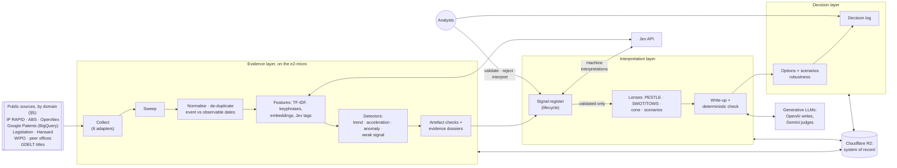

# Moria: a signal-detection and validation engine for IP Australia's strategic foresight

**Design v0.2, 2026-10-09. Status: proposed. It supersedes v0.1 (D-001); the owner decides whether to adopt it
(D-002).** Nothing is built yet.

Moria mines public data for signs of change around Australia's IP system. It is built around **strategic questions**
and six **intelligence domains**, not around frameworks. Its core is a signal engine:
1. It detects trends, accelerations, anomalies and weak signals.
2. It rules out artefacts: changes in source coverage, ingestion failures, news cycles and duplicates.
3. It assembles the evidence behind each candidate into a dossier.
4. Analysts validate each candidate before anyone interprets it.

PESTLE, SWOT, TOWS and the Futures Cone are then **lenses** over the validated signals. Each finding traces back
through three separate layers: evidence (what was observed), interpretation (what it might mean) and decision (what
IP Australia does about it).

The system uses scikit-learn for the mining, **Jev** for high-volume typed tagging, and a generative model for the
writing. Storage is Cloudflare R2 and compute is the Google Compute Engine free tier. The first step is a
**six-week proof of concept**.

This document follows the owner's SOP (`sop-agent-construction-v2.md`). It reuses the source catalogue and provenance
model in `Access-architecture-and-reusable-adapters.md`.

---

## Contents

0. [Summary](#0-summary) · 0.1 [What changed in v0.2](#01-what-changed-in-v02-and-why) ·
1. [Purpose, assumptions and scope](#1-purpose-assumptions-and-scope) ·
2. [Questions and intelligence domains](#2-questions-and-intelligence-domains) ·
3. [Method: CRISP-DM, three layers](#3-method-crisp-dm-in-three-layers) · 4. [Architecture](#4-architecture) ·
5. [Sources](#5-sources-a-portfolio-by-domain) · 6. [Data model](#6-data-model) ·
7. [Pipeline stages](#7-pipeline-stages) · 8. [The mining layer](#8-the-mining-layer) ·
9. [Jev and the generative models](#9-jev-and-the-generative-models) ·
10. [The frameworks as lenses](#10-the-frameworks-as-lenses) · 11. [How we know](#11-how-we-know-evaluation) ·
12. [Security, privacy and governance](#12-security-privacy-and-governance) ·
13. [The six-week proof of concept](#13-the-six-week-proof-of-concept) · 14. [Flags](#14-flags) ·
15. [For the owner](#15-for-the-owner) · 16. [References](#16-references)

---

## 0. Summary

**What it produces.** The proof of concept answers 5 to 8 strategic questions (§2.2). Each later quarterly cycle
answers the same set, revised. The outputs:

| Output | What the data contributes | What people contribute |
|---|---|---|
| **Signal register** (the core product) | Candidate trends, accelerations, anomalies and weak signals, each with its detectors' numbers, an artefact check and an evidence dossier | Validation: is it real, what else explains it, does it matter for Australia; then tracking over time |
| **PESTLE** | Validated *external* signals grouped into drivers, with their trends, breadth across sources and evidence | Merging, naming and adopting the drivers |
| **SWOT + TOWS** | Strengths and weaknesses measured from IP Australia's open data against peer offices; opportunities and threats from the drivers; candidate pairings | Confirming each quadrant and choosing options |
| **Futures Cone and scenarios** | *Projected* and *probable* bands from backtested baseline forecasts; scenario axes chosen from data; *possible* futures from weak signals | The scenarios developed (2 to 3 in the PoC); the *preferable* future, which is never mined; **the robustness of each option across the scenarios** |
| **Decision log** | Links from each decision to the interpretations and evidence behind it | The decisions: monitor, investigate, experiment, invest, or deliberately decline |

**The shape, in six lines:**
1. Collectors on a free-tier VM pull a portfolio of public sources through six protocol adapters. Each source has a
   card recording its coverage, cadence, lag, depth of history and biases.
2. Raw responses go into an immutable store on R2. Each item keeps its event date and the date it became observable.
3. A security sweep runs, then normalisation and de-duplication build one temporal corpus.
4. scikit-learn and DuckDB mine it in seven analytical layers (§8). The PoC prioritises four: temporal, semantic,
   anomaly and relationship mining. Jev tags each item with its relevance, domain and PESTLE dimension.
5. Detectors raise candidate signals. Each candidate passes artefact checks and gets an evidence dossier: the original
   evidence, the nearest historical analogues, and the alternative explanations to test. Analysts then validate or
   reject it in the register.
6. The framework lenses run on validated signals only. A generative model writes them up, and a deterministic check
   proves every claim and number against the evidence.

**It fits the free tiers. This was measured, not assumed** (§4.2). On this session's CPU, every planned workload
peaked at 206 to 489 MB of memory. That is within the e2-micro's 1 GB, provided jobs run one at a time. The workloads
include BM25 search for analysts and nearest-neighbour lookup.

**Expected cost:**
- infrastructure: about $0 to $4 a month;
- the proof of concept: about $20 to $40 of model APIs;
- each quarterly cycle after that: about $10 to $25.

Every paid command does a dry run before it spends (§4.5).

**I recommend:**
- running the six-week proof of concept (§13) for whole-of-agency strategy;
- making its success test whether Moria finds validated signals that a good analyst's conventional scan, done blind,
  missed.

The eight decisions I need from you are in §15. The first is the purpose: whole-of-agency strategy, IPAVentures
opportunities, or both.

---

## 0.1 What changed in v0.2, and why

An alternative view was reviewed against v0.1. Most of it improves the design and is adopted. A few points v0.1 already
covered, and three are adapted to the owner's constraints.

| Point in the alternative view | v0.1 | v0.2 |
|---|---|---|
| Build around questions, not frameworks; six intelligence domains as the collection and analysis structure | Questions existed (a pilot question), but sources and engines were organised by PESTLE, and internal factors were mixed into PESTLE columns | **Adopted.** Domains structure the sources, the questions and the register (§2). PESTLE tags *external* drivers only; SWOT combines internal and external. |
| Signal-first: candidate queue → analyst validation → interpretation; monitor whether signals persist | Mined themes went straight to drivers; analysts reviewed only at the end | **Adopted.** A signal register with a lifecycle, a validation step in week 4, and weekly tracking (§6.3, §8.4). |
| Trend ≠ acceleration ≠ anomaly ≠ weak signal ≠ wild card; weak-signal indicators | Signal types existed, but loosely defined | **Adopted,** with an operational definition and a detector for each (§8.2). |
| A spike may be a news cycle, a coverage change or an ingestion failure; an anomaly triggers investigation, not a conclusion | Not covered | **Adopted:** artefact checks on every candidate, and ingestion monitors per source (§8.3). |
| Source cards: coverage, cadence, lag, history, biases | Licence and provenance per item, but no per-source card | **Adopted.** Trend claims are limited by a source's stable history (§5.1). |
| Event date ≠ the date it became observable | Published, updated, retrieved and first-seen dates, but no event date | **Adopted:** `event_at` and `observable_at`. Point-in-time logic uses `observable_at`; patents, for example, publish about 18 months after filing (§6.1). |
| Retrieve the original evidence and historical analogues; never explain a score | The write-up check covered quotes and numbers, but explanations could start from scores | **Adopted:** evidence dossiers with nearest analogues and an alternative-explanations checklist (§8.4). |
| Separate observation from judgement: evidence, interpretation and decision layers | Jev's stance and impact sat beside measurements, in "drivers" | **Adopted.** Three layers of tables. Jev's stance and impact are *machine interpretations* at signal level, not facts about items (§3.2, §9.1). |
| Evaluate the intelligence: recovery, novelty, precision, lead time, diversity, usefulness; log misses; beware hindsight leakage | Hindsight test, precision@20 and a usefulness rating | **Adopted:** the full set, a missed-signal register, a blind conventional scan as the baseline, and stricter leakage rules. A new rule: pretrained models "know" later events (§11). |
| A six-week proof of concept with named deliverables | Phases with no calendar, and a heavy 600-item gold set up front | **Adopted** (§13). The gold set shrinks to 300 items for the per-item tags; stance and impact are judged against analysts' validations. |
| Options robust across multiple futures | TOWS options were not tested against scenarios | **Adopted:** an option × scenario robustness matrix, classifying each option as no-regret, hedge or bet (§10.4). |
| Prioritise temporal, semantic, anomaly and relationship mining; avoid sophisticated forecasting early | Quantile gradient boosting was a forecasting candidate | **Adopted.** The PoC uses baseline forecasts only. Change points, keyphrases, co-occurrence and BM25 search are added (§8.1). |
| The primary purpose: whole-of-agency strategy, IPAVentures, or both | Assumed whole-of-agency | **Adopted as owner decision 1** (§1, §15). Ranking criteria become a configurable *lens*. |
| Customer and societal signals (enquiries, feedback, search behaviour) | Absent | **Adapted:** public proxies only. Domain 4 is marked *low coverage* in every output, because its best data is internal (§5.3). |
| Stack: GitHub Actions, SQLite, Sentence Transformers, spaCy, notebooks | — | **Adapted to the owner's constraints:** GCE and R2 as specified; DuckDB and Parquet over SQLite for scans; fastembed, which runs the same embedding models without PyTorch, measured at 462 MB. GitHub Actions is the fallback for heavy one-off jobs. spaCy only if n-gram keyphrases prove poor. Notebooks for analysts. |
| No graph database, multi-agent system or sophisticated forecasting at the start | None planned | **Kept.** Co-occurrence edges are DuckDB tables; there are no agents. |

---

## 1. Purpose, assumptions and scope

**Purpose: the owner decides (decision 1 in §15).** The architecture is shared either way. What differs is the
*lens*: the source priorities, the signal-ranking criteria and what counts as strategic value.

| Lens | Serves | Ranks signals by | Data it needs most |
|---|---|---|---|
| **Agency strategy** (recommended for the PoC) | The Strategic Corporate Plan and executive strategy | Expected impact on the agency's objectives (Impact, Customer, Capability, Innovation); breadth; lead time; uncertainty | All six domains; public data covers five of them well |
| **IPAVentures** (the agency's in-house innovation lab, since 2021) | Its stage-gated venture pipeline (for example, IP First Response) | Unmet customer need × IP Australia's right to play × feasibility × time to a first test | Domain 4 (customer needs), which public data covers poorly |

I recommend the agency-strategy lens for the PoC. An IPAVentures lens is worth adding once internal customer data
(enquiries, search logs, service feedback) can be used, in an agency-approved environment.

**Assumptions** (tell me if any is wrong):
- **"Jev" is TypeSafe's Jev,** a transformer *decision* model released in mid-September 2026. It takes a text and typed
  questions (yes/no, choice, score) and returns answers with probabilities. It cannot write, so the writing needs a
  generative model.
- **The users are people:** strategy and policy analysts, and the executives who read their products. Outputs are
  structured JSON first.
- **Public data only,** which is what makes a US-hosted free tier acceptable (§12).
- **Horizon:** now to 2036. H1 = 0 to 2 years, H2 = 2 to 5 years, H3 = 5 to 10 years and beyond.

**Not in scope:**
- internal or non-public data;
- any decision about an individual application or applicant;
- replacing workshops, stakeholder input or judgement on values;
- choosing the preferable future;
- a web application, a graph database, or agents.

---

## 2. Questions and intelligence domains

### 2.1 The six domains

The domains are the collection and analysis structure. Every source, question and signal belongs to one or more of
them.

| # | Domain | The standing question | Kinds of evidence |
|---|---|---|---|
| D1 | **The IP system and its operating environment** | What is changing in IP law, litigation, regulation, treaties, enforcement and administrative practice? | Legislation, judgments, consultations, treaties, examination guidance |
| D2 | **The Australian economy and innovation system** | Which industries, business models and innovation activities are growing, shrinking or changing character? | ABS data, business counts, filings by sector, research output |
| D3 | **Technology and new forms of IP** | Which technologies are creating new IP assets, new infringement risks or new demands on IP administration? | Patent titles and classes, papers, preprints, technology reporting |
| D4 | **Customer needs and behaviour** | Where are businesses struggling to understand, obtain, protect or commercialise their IP? | Public proxies only (§5.3): filing behaviour, disputes, published service results, public discussion |
| D5 | **Geopolitics and international developments** | How are global competition, trade policy, supply chains and foreign IP offices changing the environment? | Foreign-office statistics and publications, trade developments, global filing patterns |
| D6 | **Institutional capability and business models** | What capabilities will IP Australia need, and where could its services, operating model or role evolve? | Peer-office strategies and annual reports, IP Australia's own performance, public-sector capability reports |

**How the frameworks relate:**
- **PESTLE** is an external-environment framework. It tags external drivers, which come from D1, D2, D3 and D5. It
  never tags IP Australia itself.
- **SWOT** combines the internal (D4 and D6, plus IP Australia's own data) with the external drivers.
- **The Futures Cone** takes the drivers' uncertainty and the weak signals.

None of these frameworks is a data-mining algorithm. They are ways of reading the register.

### 2.2 Starter questions for the PoC

These are drafts for the owner to edit. There are seven, and each names the domains it draws on.

1. How could AI change the demand for, and the administration of, IP rights in Australia, 2026–2036? (D3, D1, D6,
   D4)
2. Which changes in IP law, courts, treaties and examination practice could most alter how Australian rights are
   obtained or enforced by 2030? (D1, D5)
3. Which Australian industries and business models are changing their use of IP rights, and in which direction?
   (D2, D3)
4. Which emerging technologies are creating new kinds of IP assets, new infringement risks or new examination
   demands? (D3)
5. Where do businesses, especially SMEs, show signs of struggling to obtain, protect or enforce IP? (D4; low
   coverage)
6. How are trade policy, technology competition and foreign IP offices changing who files in Australia, and why? (D5,
   D2)
7. What capabilities and service models are peer IP offices investing in, and what does that imply for IP Australia?
   (D6, D5)

### 2.3 Written down in week 1, before any mining

- **The known-issues baseline.** These are the issues IP Australia already names in the Strategic Corporate Plan
  2026–27, the Australian IP Report and other recent strategy documents. They are extracted with citations and
  confirmed by analysts. A validated signal outside this list counts as *novel* (§11).
- **What counts as a meaningful signal.** It must meet all four tests:
  1. it survives the artefact checks;
  2. it appears in at least one credible family beyond news, or in news with a confirmed primary source;
  3. an analyst can state a plausible mechanism linking it to one of the questions;
  4. its Australian relevance is assessed.
- **The hindsight set and its pass rules** (§11). Analysts choose them blind to Moria's output.

---

## 3. Method: CRISP-DM in three layers

### 3.1 The cycle

CRISP-DM (the Cross-Industry Standard Process for Data Mining) is the outer cycle. v0.2 adds an explicit
**validation** step between mining and interpretation, as part of CRISP-DM's evaluation phase.

| Phase | What Moria does | Artefact | Gate |
|---|---|---|---|
| 1. Business understanding | Questions, domains, the lens, the known-issues baseline, the definition of a meaningful signal, the hindsight set | `config/questions.yaml`, `config/lens.yaml`, `config/codebook.yaml`, `eval/hindsight.yaml` | **Owner** approves |
| 2. Data understanding | Source cards; a census of each source (counts, fields, dates, gaps); ingestion monitors | `config/sources/*.yaml`, `reports/sources/*.md` | — |
| 3. Data preparation | Collect, sweep, normalise, de-duplicate, resolve entities, build features | Parquet in `lake/` and `features/`, with manifests | — |
| 4. Modelling | The seven analytical layers (§8.1) and the detectors (§8.2) | Candidate signals with metrics | Measured method choices go to the **owner** |
| 5a. Evaluation of methods | Component yardsticks (§11.2) | `reports/eval/*.md` | — |
| **5b. Validation of signals** | Artefact checks, dossiers, analyst review, alternative explanations | Signal-register events | **Analysts** validate or reject |
| 6. Deployment | Lenses (PESTLE, SWOT and TOWS, the cone and scenarios, robustness), the write-up with its check, the decision log, tracking | `scans/<scan_id>/` | **Analysts** review in a workshop; **decision-makers** log decisions |

### 3.2 Three layers, kept apart

| Layer | Holds | Who writes it | Rule |
|---|---|---|---|
| **Evidence** | Raw and normalised items; measurements (counts, rates, slopes, change points, anomaly scores, co-occurrence lifts); per-item *descriptive* tags (relevant, domain, PESTLE, rights affected) | The pipeline, reproducibly | A label that says **what an item is about** is a feature, so it belongs here. Nothing here says what anything means for IP Australia. |
| **Interpretation** | Signals and their lifecycle; alternative explanations; Australian relevance; stance, impact, horizon and uncertainty; drivers; framework placements; scenarios | Analysts, and models labelled as such (backend, version, probabilities) | A label that judges **what it means** belongs here. Several interpretations of the same evidence can coexist, each versioned and attributed. |
| **Decision** | Monitor, investigate, experiment, invest, or deliberately decline; options and their robustness; owners; review dates; outcomes | Decision-makers | Each decision links to the interpretations, and through them to the evidence. |

That lets a decision-maker challenge the reasoning (the interpretation) without rebuilding the pipeline (the evidence).

---

## 4. Architecture



### 4.1 Where things run

| Component | Where | Why |
|---|---|---|
| Scheduler and every pipeline job | **GCE e2-micro** (2 shared vCPUs at 0.25 vCPU sustained, 1 GB RAM, 30 GB standard disk), **us-west1** (Oregon) | The free tier. Of the three free regions, Oregon is the closest to Australia. |
| System of record: raw, lake, register events, decisions, models, scans, manifests | **Cloudflare R2**, one bucket `moria`, with a token scoped to it | Free egress means the VM, analysts and later tools read it at no cost. The VM's disk is only a cache, so the VM can be rebuilt at any time. |
| Global patent aggregates | **BigQuery** (Google Patents Public Datasets) | 1 TiB of queries a month is free. Aggregate queries only; each is dry-run first and capped by `maximum_bytes_billed`. |
| Typed tags and machine interpretations | **Jev API** (`POST https://api.typesafe.ai/v1/systemone`, as reported; to confirm) | Calibrated probabilities at about $0.042 per million input tokens, with free output (reported) |
| Writing and judging | **OpenAI** writes; **Gemini** judges (or the reverse) | A judge never shares the writer's model family (SOP §12) |
| Tracing | **Langfuse** | SOP D-045/D-056. Jev batches are traced per batch, and per-item tags go in Moria's own store. |
| Analyst workspace | Notebooks against R2 (DuckDB), and register exports as spreadsheets | Analysts need to search and read, not to run the pipeline |
| Heavy one-off jobs (backfill), if needed | A GitHub Actions runner or a temporary larger VM | Only if the backfill estimate exceeds about 3 days on the e2-micro (§14) |

**Software:** one Python 3.11 package, `moria`, managed with uv (lockfile committed), with a typer CLI named `moria`.
Config is YAML validated by pydantic, and unknown keys are errors. Main libraries: scikit-learn, scipy, statsmodels,
ruptures (change points), DuckDB (with its `fts` extension), pyarrow, httpx, the pinned provider SDKs, and langfuse.
fastembed is an optional extra.

**Deployment:**
- a startup script installs uv, checks out a pinned tag, runs `uv sync --frozen`, and installs the systemd units;
- no inbound ports are open, and SSH goes through IAP with OS Login;
- OS patches install unattended.

### 4.2 Fitting the free tiers (measured)

`scripts/memprobe.py` measures each planned workload's peak memory, each in its own process. The data is synthetic,
at the planned scale. Each workload imports only what its real job would.

These are the numbers from this session's machine:
- Xeon at 2.8 GHz, BLAS limited to 2 threads;
- Python 3.11.17, scikit-learn 1.9.1, DuckDB 1.5.6, pandas 3.0.6, pyarrow 26.0.0, fastembed 0.9.0.

| Workload | Peak memory | Time here |
|---|---|---|
| Imports only (scikit-learn, pandas, pyarrow, DuckDB) | 206 MB | 2.1 s |
| Text classifier: 200k documents streamed (`HashingVectorizer` 2^20 + `SGDClassifier.partial_fit`) | 264 MB | 40 s |
| `MiniBatchKMeans` (k = 200) on 200k × 384 vectors streamed, then `IsolationForest` on 50k | 287 MB | 10.9 s |
| Topics: `MiniBatchNMF`, 50 topics, 100k documents, 20k-term TF-IDF vocabulary | 294 MB | 43.6 s |
| Topics: the same with 2^18 hashed features | **844 MB** | 244 s |
| DuckDB: a 20M-row Parquet file, group-by and median, `memory_limit = 300MB` | 286 MB | 6.1 s |
| `HDBSCAN` on 20k points after PCA to 20 dimensions | 257 MB | 34.5 s |
| **Analyst search:** DuckDB full-text index over 100k documents of 150 words, BM25 query | 484–489 MB | 59–78 s (index build) |
| **Nearest neighbours and near-duplicates:** cosine top-10 for 500 queries over 200k float16 vectors, in chunks of 20k | 341 MB | 5.7 s |
| Local embeddings: `bge-small-en-v1.5` (ONNX through fastembed), texts of about 80 tokens | 462 MB | 18.1 texts/s on 1 thread |

Repeat runs varied by about 10%.

**Rules that follow from these numbers:**
- **One job at a time.** Jobs are serialised with `flock`, and each systemd unit has `MemoryMax=700M`. The OS takes
  about 200 to 300 MB.
- **A 2 GB swap file is a safety net only.** A job that swaps is reported as a bug.
- **Streaming:** batches of 10k or fewer, through the `partial_fit` estimators.
- **Vocabularies capped at 20k terms.** Never fit a dense model over hashed features: that was the one failure above.
- **DuckDB** runs with `memory_limit='300MB'` and reads Parquet from R2 with `CREATE SECRET (TYPE r2, …)`.
- **Full-text indexes** hold 100k documents or fewer each, partitioned by family and year.
- **HDBSCAN and neighbour search** run on chunks or samples of 20k. Vectors are stored as float16.

**CPU caveat:** the e2-micro sustains 0.25 vCPU, so expect jobs to take 4 to 8 times as long as here. Phase 0
re-runs the probe on the real VM (SOP §24).

**Where the other free-tier limits bite:**

| Limit | Moria's load (estimate) | How the design stays inside it |
|---|---|---|
| R2: 10 GB-month | 4 to 6 GB in year 1 | **Aggregate at the source** (counts from OpenAlex, BigQuery and GDELT, plus capped samples, never mirrors); Parquet with zstd; IP RAPID as one base snapshot plus weekly change-sets |
| R2: 1M Class A (writes) and 10M Class B (reads) a month | About 3k writes and under 1M reads | One compressed JSONL object per source per run; caches as Parquet segments |
| GCP egress: 1 GB a month free, **excluding Australia** | 0.3 to 1 GB a month of uploads to R2 | Compressed, derived data and deltas only; bytes metered per job; reports served from R2, never from the VM |
| BigQuery: 1 TiB of queries a month | A few aggregate queries a quarter | Only the needed columns; every query dry-run first; a hard `maximum_bytes_billed` in config |

### 4.3 Storage layout on R2

```text
moria/
  raw/<source>/<yyyy>/<mm>/<dd>/<run_id>.jsonl.zst        # request/response envelopes; immutable
  raw/ip_rapid/<release_date>/manifest.json                # hashes of each weekly zip; base snapshot quarterly
  lake/evidence/part-*.parquet                             # provenance envelope for every item (§6.1)
  lake/documents/family=<f>/month=<yyyy-mm>/part-*.parquet
  lake/observations/series=<id>/vintage=<date>/part.parquet
  lake/ip_rapid/base=<date>/<table>.parquet  +  delta=<date>/<table>.parquet
  features/{tfidf,keyphrases,embeddings,tags}/...          # tags = Jev, scikit-learn and human labels (evidence layer)
  measures/{rates,trends,changepoints,anomalies,cooccurrence}/run=<id>/...
  monitors/ingestion/source=<s>/part.parquet               # expected vs actual volumes, per source per period
  interpretation/register/events/part-*.parquet            # append-only signal-register events (§6.3)
  interpretation/dossiers/<signal_id>/<version>.md
  interpretation/{drivers,placements,scenarios}/...
  decision/log/events/part-*.parquet
  models/<name>/<version>/{model.joblib, card.json}        # loaded only if the SHA-256 matches the manifest
  scans/<scan_id>/{register,pestle,swot,cone,robustness}.json  report.md  report.html  charts/
  manifests/<command>/<run_id>.json
```

### 4.4 Scheduling (systemd timers; UTC)

| Cadence | Jobs |
|---|---|
| Daily | Feeds and incremental APIs; sweep; normalise; de-duplicate; ingestion monitors |
| Weekly | IP RAPID refresh; ABS releases; Jev tags for new items; embeddings; detectors; artefact checks; **the register digest** (new candidates, and changes to tracked signals) |
| Monthly | Trend and change-point statistics; baseline forecasts; drift checks |
| Quarterly (after the PoC) | The scan: lenses, write-up, check, judge, robustness, workshop. The April–June scan feeds the Corporate Plan, which is published around September. |

### 4.5 Costs

| Item | Estimate | Notes |
|---|---|---|
| e2-micro VM and 30 GB disk | $0 a month | Free tier, us-west1 |
| External IPv4 address | about $3.65 a month *(unverified)* | In-use external IPv4 is billed at $0.005 an hour; I found no statement that the free tier waives it |
| GCP egress | $0 to $0.20 a month | 1 GB free |
| R2, BigQuery, Secret Manager | $0 | Inside their free tiers, with caps |
| **The proof of concept** | **$20 to $40 in total** | Jev tags for 2–3 years of pre-screened text (100k–150k items) $5 to $7; the tagger measurement about $3; signal-level Jev interpretations, cents; write-ups and judging $5 to $20; embeddings local, $0; backfill of counts, $0 |
| Each quarterly cycle after the PoC | $10 to $25 | About 60k new items at about 1,150 billed tokens each (17 short questions), so about 70M tokens, which is about $3 of Jev at the reported price. Whether the state is billed once per request is not confirmed; the dry run will show it. Write-ups and judging cost $5 to $20. |

**Money rules (SOP §14.1):**
- Every paid command has `--dry-run`, `--confirm`, and `--limit N --confirm`.
- Budgets live in config and the code enforces them.
- Every paid response is cached under a full key.
- There is a GCP budget alert at $5 a month. R2 usage is checked weekly, because R2 has no spending cap.

---

## 5. Sources: a portfolio, by domain

News over-represents events that attract attention and under-represents slow structural change. So the portfolio
deliberately mixes three kinds:
- **administrative data:** IP RAPID;
- **structured statistics:** ABS, WIPO, OpenAlex counts, patent aggregates;
- **unstructured text:** legislation, Hansard, publications, news titles.

**Principle: normalise protocols, not providers** (from the Access architecture document). Tier 1 needs six adapters:
`bulk`, `sdmx`, `rest`, `rss`, `bigquery` and `html`.

### 5.1 Source cards

Each source has a card in `config/sources/<id>.yaml`, written in week 1 and checked in the census:

| Field | Why it matters |
|---|---|
| `domains`, `families` | Where its signals count |
| `coverage` | Jurisdictions, languages, rights types, which publishers |
| `cadence`, `publication_lag` | How early it can show anything; detectors' windows are set from this |
| `history_start`, `stable_since`, `breaks` | **No trend claim over a window longer than the source's stable history.** Methodology breaks and Moria's own onboarding date are modelled as structural breaks, not as change. |
| `known_biases` | For example: GDELT over-weights English-language and large outlets; OpenAlex's coverage of recent years fills in late; IP RAPID shows only published applications |
| `revision_policy` | Whether figures are revised (ABS), so that vintages are kept |
| `licence`, `snapshot_rights` | What may be stored and shown |
| `expected_volume` | The ingestion monitor's baseline (§8.3) |

### 5.2 Tier 1: the PoC portfolio

Eleven sources across the six domains. Access and licence are confirmed in week 1.

| Source | Domains | Adapter | What Moria takes |
|---|---|---|---|
| **IP RAPID** (IP Australia; weekly; CC BY 4.0; `IPRAPID.zip` 1.35 GB, refreshed 2026-10-05) | D2, D3, D4, D6 | `bulk` | Six tables: application, party-activity, application-links, application-events, application-classification, application-description. Covers IPC and Nice classes, WIPO's 35 technology fields, event dates, PCT and Madrid links, and parties with ABNs. Also the **dispute and behaviour patterns** behind D4: oppositions, non-use removals, lapses, self-filing. |
| **ABS Data API** | D2 | `sdmx` | Business R&D, business entries and exits, trade in services (including charges for the use of IP), industry structure |
| **OpenAlex** | D3, D2 | `rest` (key; metered) | Counts by topic × year × country (`group_by`); abstracts of Australian-affiliated and question-relevant works. It covers arXiv preprints, so arXiv waits for Tier 2. |
| **Google Patents Public Datasets** | D3, D5 | `bigquery` | Global filings by IPC/CPC × office × year; first-seen code pairs. Aggregates only. |
| **WIPO IP Statistics Data Center** | D5, D6 | `bulk` | Office-level filings, resident and non-resident shares, and growth, for peer offices |
| **Peer IP offices' strategies and annual reports** (UKIPO, IPONZ, CIPO, IPOS, EUIPO, EPO, USPTO, JPO, KIPO) | D6, D5 | `html` and PDF | Capability investments, service models, AI use, published performance |
| **Federal Register of Legislation** | D1 | `rest` or `rss` (to confirm) | IP Acts and regulations; changes and new instruments |
| **Parliament: Hansard and Senate Estimates** | D1, D4, D6 | APH, or the OpenAustralia API (non-commercial terms; to confirm) | Passages that mention IP Australia or the IP system |
| **IP Australia publications** | D1, D4, D6 | `html` and PDF | Corporate Plan, Annual Report (performance and customer results), Australian IP Report, consultations, **examination-practice changes**, news |
| **WIPO news and treaty pages** | D1, D5 | `rss` and `html` | Treaty developments, committee outcomes |
| **GDELT DOC 2.0 API** | D1, D3, D4, D5 | `rest` | Article titles and metadata only, for IP, innovation, scam and enforcement queries |

### 5.3 Coverage gaps, stated in every output

- **D4 (customer needs) is low coverage.** Its best evidence is internal: enquiries, search logs, complaints and
  service feedback. Public proxies are filing behaviour and disputes from IP RAPID, published customer results,
  Estimates questions, and news titles about scams and infringement. Every D4 finding carries a *low coverage* label.
  This is the gap that most limits an IPAVentures lens.
- **Courts:** AustLII's terms restrict automated bulk access. Federal Court judgments and IP Australia's hearing
  decisions wait for permission or for another route (Tier 2).
- **Non-English sources:** these are absent in the PoC, which under-represents Asian offices and markets in D5.

### 5.4 Tier 2, after the PoC

Taken mostly from the Access architecture document's catalogue:
- procurement and budgets: AusTender (OCDS) and budget papers;
- patents: EPO OPS, USPTO ODP;
- preprints: arXiv;
- standards bodies;
- foreign regulation: EUR-Lex, the US Federal Register;
- macro context: OECD, IMF, World Bank, UN Comtrade;
- environment: Copernicus;
- early signals: Media Cloud, Bluesky Jetstream, Hacker News, GitHub;
- search trends (an official API, if available);
- courts, with permission.

Each new source extends the hindsight set and the source cards.

---

## 6. Data model

### 6.1 The evidence envelope

This is the Access architecture document's provenance model, trimmed, plus two dates added in v0.2.

| Field | Meaning |
|---|---|
| `evidence_id` | SHA-256 of `provider` + `provider_record_id` + `content_hash` |
| `provider`, `source_collection`, `provider_record_id` | The canonical producer, the dataset and the upstream id |
| `kind`, `family`, `domains` | `document`, `observation` or `ipr_record`; the source family; the domains D1–D6 |
| **`event_at`** | When the thing happened: filing date, judgment date, event date |
| **`observable_at`** | When it became publicly observable: publication date, release date. **All point-in-time logic uses this.** A patent filed in 2024 may not be observable until 2025 or 2026. |
| `provider_updated_at`, `retrieved_at`, `first_seen_at` | Revision time; retrieval time; the first time Moria saw it |
| `dedup_group` | Near-duplicate group: syndicated copies and reposts count once |
| `retrieval_method`, `request_hash`, `tool_identity`, `parser_version` | How it was retrieved and parsed |
| `raw_object_uri`, `raw_content_hash`, `licence`, `security` | Pointer, hash, rights, sweep findings |

### 6.2 Evidence-layer tables

| Table | Holds |
|---|---|
| `documents` | Text, title, language, country, family, domains, dates, `dedup_group` |
| `observations` | `series_id`, `period`, `value`, `unit`, `vintage` |
| `ipr_*`, `ipr_metrics` | IP RAPID tables, plus demand, timeliness, outcomes and behaviour metrics |
| `tags` | Descriptive per-item labels: `relevant`, `domain_*`, `pestle_*`, `rights_*`, with backend, version and probabilities |
| `keyphrases`, `embeddings`, `topics`, `doc_topics` | Text features and clusters, with run ids |
| `measures` | Rates per source volume, slopes and CIs, accelerations, change points, anomaly scores, co-occurrence lifts |
| `ingestion_monitor` | Expected against actual volume per source per period, and incidents |

### 6.3 Interpretation and decision layers

**The signal register** is an append-only event log. Its current state is a view, so the full history of each signal
is kept, which is how persistence is tracked.

| Field | Meaning |
|---|---|
| `signal_id`, `title`, `type` | `trend`, `acceleration`, `anomaly`, `weak_signal` or `wild_card` (§8.2) |
| `questions`, `domains` | Which questions it bears on |
| `detectors` | Which detectors fired, with their numbers and run ids (links into the evidence layer) |
| `artefact_check` | Pass, or the flags raised: coverage, ingestion, duplicate, news cycle, source break, label drift |
| `dossier` | The versioned dossier (§8.4) |
| `status` | `candidate` → `investigating` → `validated` or `rejected` → `tracked` → `strengthened`, `weakened`, `disproved` or `mainstream` |
| `rejection_reason` | `artefact`, `news_cycle`, `duplicate`, `not_relevant`, `already_known`, `insufficient_evidence` |
| `alternatives_considered`, `australian_relevance` | Recorded by the analyst |
| `interpretations[]` | Each one: author (an analyst, or a model with its version), stance, impact, horizon, uncertainty, PESTLE tags (external signals only), rationale, confidence, date. Disagreements stay side by side. |
| `novel` | Not in the known-issues baseline (§2.3) |

Other tables:
- **Interpretation:** `drivers` (groups of validated signals), `placements` (where each driver or signal sits in each
  lens), `scenarios`, `claims` (cited propositions in the write-ups).
- **Decision:** `options`, `robustness` (option × scenario ratings), and `decisions` (action, linked
  interpretations, owner, rationale, review date, outcome).

**The missed-signal register** records each development that analysts, the conventional scan or later events showed
Moria missed. It records the reason: a source gap, a detector gap, or a ranking cut-off. That keeps Moria from tuning
itself only towards what it already detects.

**Point in time.** A scan at `as_of` reads only evidence with `observable_at <= as_of` and
`first_seen_at <= as_of` (backfilled items have only `observable_at`). Every model used at that date is fitted on that
evidence alone (§11.3).

---

## 7. Pipeline stages

Every stage follows the SOP's §16.1 contract:
- one module and one command per stage;
- verified upstream outputs only;
- atomic writes, and idempotent runs;
- a manifest and a report per run;
- loud failure, with exit code 2.

| Stage | Command | Writes | Spends |
|---|---|---|---|
| Collect | `moria collect <source>` | `raw/` | BigQuery bytes (capped) |
| Sweep | `moria sweep` | Findings; quarantine | — |
| Normalise | `moria normalise` (including `dedup_group`, `event_at` and `observable_at`) | `lake/` | — |
| Monitor | `moria monitor ingestion` | `monitors/`; incidents | — |
| IP RAPID | `moria ipr refresh`, `moria ipr metrics` | `lake/ip_rapid/`, `ipr_metrics` | — |
| Features | `moria features tfidf\|keyphrases\|embed\|index` (`index` builds BM25) | `features/` | — |
| Tag | `moria tag --backend jev\|sklearn\|llm` | `features/tags/` | Jev or LLM tokens |
| Measure | `moria measure rates\|trends\|changepoints\|anomalies\|cooccurrence\|forecast` | `measures/` | — |
| Detect | `moria detect --as-of <date>` | Candidate signals | — |
| Check | `moria artefacts --as-of <date>` | Artefact flags on candidates | — |
| Dossier | `moria dossier <signal_id>` | `interpretation/dossiers/` | — |
| Interpret | `moria interpret <signal_id> --backend jev` | A machine interpretation in the register | Jev tokens (cents) |
| Register | `moria register export\|import` (spreadsheet round trip, validated, appended as events) | Register events | — |
| Lenses | `moria lens pestle\|swot\|cone\|robustness --scan <id>` | Placements, scenarios, options | — |
| Write-up | `moria write`, `moria check`, `moria judge` (`--scan <id>`) | Report, claims, check, grades | LLM tokens |
| Decide | `moria decision add` | Decision-log events | — |
| Eval | `moria eval tags\|themes\|forecast\|hindsight\|intelligence` | `reports/eval/` | Candidates' tokens |

---

## 8. The mining layer

### 8.1 Seven analytical layers

The PoC builds the four priority layers in full. The other three get only what those four need.

| Layer | Methods | Tools | What it discovers | PoC |
|---|---|---|---|---|
| Descriptive | Counts, **rates per source volume**, distributions, cross-tabs | DuckDB | What is happening? | Yes (the base for everything) |
| **Temporal** | Rolling averages; Theil–Sen slopes with CIs; **acceleration** (change in slope between periods); **change points** (PELT, CUSUM); Mann–Kendall with Holm adjustment | scipy, statsmodels, ruptures | What is changing unusually quickly? | **Priority** |
| Text mining | TF-IDF; **BM25 search** for analysts; **keyphrases** (n-gram TF-IDF, spaCy only if these prove poor); new-term detection; NMF topics as a cross-check | scikit-learn, DuckDB `fts` | What subjects are appearing, and how are they discussed? | Partly: keyphrases, new terms, search |
| **Semantic** | Embeddings; MiniBatchKMeans and HDBSCAN clusters; nearest neighbours (analogues, near-duplicates) | fastembed, scikit-learn, numpy | Which items discuss similar ideas, including in unfamiliar terms? | **Priority** |
| **Anomaly** | Statistical baselines: exact Poisson rate tests from low baselines; IsolationForest and LocalOutlierFactor novelty against a trailing window | scipy, scikit-learn | What is unusual against history? | **Priority** |
| **Relationship** | Co-occurrence of keyphrases, clusters, entities and classes across families and over time (new edges, rising lift); association rules on IPC pairs and Nice-class sets; cross-family convergence | DuckDB | Which developments, actors, technologies or problems are becoming connected? | **Priority** |
| Predictive | Baseline forecasts (seasonal naive, ETS) with intervals and rolling-origin backtests; supervised models only where labels exist (the tags) | statsmodels, scikit-learn | What may happen next, with what uncertainty? | Baselines only |

The memory-safe forms are as in §4.2: `partial_fit`, capped vocabularies, chunked neighbours, and partitioned
indexes.

### 8.2 Signal types and their detectors

| Type | Operational definition | Detector |
|---|---|---|
| **Trend** | A measurable, sustained change in a rate or share | The Theil–Sen CI excludes 0 in at least 2 of 3 windows (12, 24, 36 months, each within `stable_since`), after Holm adjustment |
| **Acceleration** | A trend whose rate of growth is itself increasing | The slope in the recent half exceeds the slope in the earlier half, with a bootstrap CI excluding 0; or a PELT change point to a steeper slope |
| **Anomaly** | An observation significantly different from its baseline | Outside the baseline's 99% band, or a change point in level. **This triggers investigation; it is not yet a signal.** |
| **Weak signal** | An early, possibly meaningful indication of a possible future development; often sparse, ambiguous, or spread across disparate sources | Any of the five indicators below, with at least 3 items from at least 2 sources |
| **Wild card** | A low-probability, high-impact development | **Not detected.** Proposed from validated weak signals (by analysts, or by the generative model), and curated by analysts |

**The five weak-signal indicators:**
1. **`new_term`:** a keyphrase first seen in a credible family (research, patent, legal or policy) within the window.
   It needs a document frequency of at least k across at least 2 sources.
2. **`new_combination`:** a first-seen or sharply rising co-occurrence (lift) between previously separate clusters,
   keyphrases, IPC subclasses or Nice classes.
3. **`cross_family`:** a concept or cluster appears in at least 3 families within the window (for example research,
   legal and policy), where it had appeared in at most 1 before.
4. **`low_base_surge`:** a rate ratio against a low trailing baseline, by exact Poisson test, with at least 5 items.
5. **`novel_items`:** items far from all clusters (IsolationForest or LOF on embeddings). They are grouped into
   micro-clusters before review, so analysts see themes, not single items.

**Priority in the review queue.** The queue is ranked by the lens's criteria (§1). For the agency-strategy lens these
are:
- detector strength;
- breadth across families;
- lead time;
- the probability of relevance to the questions.

Jev's *machine* impact estimate may raise a sparse item's priority, so that early, high-implication items are not lost.
It never validates anything. The weights are in config, and the report shows how sensitive the ranking is to them.

### 8.3 Artefact checks

Every candidate passes these checks before review. A failed check is shown to the analyst; it does not hide the
candidate.

| Check | What it catches | Rule |
|---|---|---|
| Coverage | A source publishing more overall, not more about the topic | Counts are expressed as shares of the source's total volume. Flag if that total moved more than ±25% in the same window. |
| Ingestion | Failed or duplicated collection | `ingestion_monitor` incidents (volume outside the expected band, gaps, retries) hold signals in the affected windows |
| Duplication | One story syndicated 200 times | Collapse by `dedup_group` (canonical URL, then cosine ≥ 0.95 within 30 days) before counting |
| News cycle | A burst of attention without substance | Only the news family; decays within about 2 weeks; no primary source in the dossier |
| Source break | A methodology change or Moria's own onboarding | Windows crossing `breaks` or onboarding dates are excluded from trend claims |
| Label drift | A change in the tagger, not in the world | Counts across a window always use one tagger version (re-tag, or restrict the window) |

### 8.4 Evidence dossiers

Explanations start from the evidence, never from a score. Each candidate's dossier holds:
- **the detectors' numbers,** with the windows and run ids;
- **the original evidence:** the top items by relevance, de-duplicated, with links and dates (event and observable);
- **the nearest historical analogues:** nearest-neighbour items from earlier periods, and what became of them, from the
  register's history;
- **an alternative-explanations checklist:** coverage, ingestion, news cycle, duplication, source break, a known
  seasonal or administrative cause (for example a fee change or a law's commencement date), and the known-issues
  baseline;
- **counter-evidence:** BM25 and neighbour searches for items that contradict the signal.

Analysts read the dossier, search further in a notebook, and record status, alternatives, relevance and their
interpretation. A machine interpretation (§9.1) may be attached, and is labelled as such.

---

## 9. Jev and the generative models

### 9.1 Two uses of Jev, one per layer

Jev takes a *state* (text, defanged and wrapped as data) and typed questions. Per third-party write-ups, to confirm in
week 1, there are three kinds:
- `noul`: yes or no;
- `choice`: up to 255 options;
- `score`: ordered levels.

Each answer comes back with per-option probabilities and a confidence value. The state plus the longest question must
fit within 32k tokens. Question sets are versioned and locked like prompts.

**Per item: descriptive tags, in the evidence layer.** These run on every item that passes the scikit-learn
pre-screen:
- `relevant` (noul): could this plausibly affect Australia's IP system, IP Australia, or the people and businesses who
  use IP rights in Australia, within ten years?
- `domain_d1` … `domain_d6` (six nouls);
- `pestle_*` (six nouls), used only when the item is external;
- `rights_patents`, `rights_trade_marks`, `rights_designs`, `rights_pbr` (four nouls).

The tags are used as **expected counts** (sums of probabilities), so their calibration is measured (§9.2).

**Per signal: machine interpretations, in the interpretation layer.** These run on the dossier, which fits the 32k
state limit:
- `stance` (opportunity, threat, both, neither), relative to the lens's objectives;
- `impact` (five levels);
- `horizon` (H1, H2, H3);
- `settledness` (from contested to settled);
- `signal_type_check`: does the dossier read as a trend, a weak signal or noise?

These are suggestions for analysts, attributed to Jev and its version. They are compared against analysts'
interpretations, which become their test set (§11.2).

**Jev sits behind an adapter.** Access is early, signups were reported paused on 22 September, and its benchmarks are
the vendor's own. Every tag and interpretation has `jev`, `sklearn` and `llm` backends with one contract.

### 9.2 Choosing the tagger by measurement (sized for the PoC)

This is fixed in advance, in the commit that adds the gold set:
- **The gold set:** 300 items, stratified by family. Two analysts label a 20% overlap, and Cohen's kappa is reported.
  The labels are relevance, domain and PESTLE only.
- **Candidates, simplest first:**
  1. scikit-learn trained on gold dev;
  2. Jev zero-shot;
  3. Jev with isotonic calibration;
  4. scikit-learn distilled from Jev silver labels;
  5. a small LLM (the fallback).
- **Metrics:** macro-F1, PR-AUC, Brier score and ECE (whether "70%" comes true about 70% of the time), and the cost
  per 1k items.
- **The rule:** the simplest candidate within 0.02 macro-F1 of the best on dev, with ECE ≤ 0.05 after calibration.
  The result is reported on test with bootstrap 95% intervals.
- **Precision:** with 150 test items, the standard error of an F1 is about 0.04, so gaps under about 0.1 can't be
  separated. That is enough for the PoC's question, which is whether the tags are good enough to filter and count. A
  larger set comes when scaling.
- The result is a recommendation; the owner adopts (SOP §5).

### 9.3 Generative models: naming, writing, wild cards

A generative model does these jobs:
- naming clusters;
- drafting driver statements from validated signals;
- proposing wild cards and TOWS options;
- writing scenario narratives and the scan report.

It only ever sees dossiers and validated register entries, wrapped as data.

**The deterministic check** confirms:
- every cited `evidence_id` was shown;
- every quote is verbatim;
- **every number in the prose appears in the metrics given**;
- every signal cited is `validated` or `tracked`, unless the text explicitly marks it as a candidate.

A failure is retried once. An answer that still fails is shipped flagged.

**A judge from the other model family** grades each report. Its rubric: grounded; balanced (does it report
counter-evidence and the alternatives considered?); specific to IP Australia; distinct.

| Work | Model class (SOP §14.3) |
|---|---|
| Per-item tags, per-signal suggestions | Jev, or a small LLM behind validation (§9.2) |
| Relevance pre-screen | scikit-learn |
| Embeddings | Local `bge-small-en-v1.5` (MIT licence, pinned revision, no `trust_remote_code`) |
| Cluster naming | A small model |
| Write-ups, options, scenarios, wild cards | A strong model at medium effort |
| Judge | The other family |

---

## 10. The frameworks as lenses

Each lens reads **validated** register entries only. Candidates appear in an appendix, labelled as candidates.

### 10.1 PESTLE (external drivers only)

1. Take the validated *external* signals (D1, D2, D3, D5, and external D6 items such as peer-office moves).
2. Group them into drivers: clusters of signals that share evidence, keyphrases or co-occurrence links. Analysts merge,
   split and name them.
3. Place each driver by its PESTLE tags. Analysts' tags win over machine tags.
4. For each driver, show its trends and accelerations, its breadth across families, its horizon, its interpretations
   (analyst and machine, side by side) and its evidence.

**The PESTLE codebook, tailored to IP** (v1; the owner approves it in week 1):

| Dimension | What counts |
|---|---|
| **Political** | Government priorities; parliament; treaties; FTA IP chapters (for example GIs under the Australia–EU FTA); WIPO diplomacy; technology geopolitics |
| **Economic** | Growth, productivity and R&D; business formation; trade and IP royalty flows; exchange rates; the cost of rights; industry structure |
| **Social** | Skills; attitudes to creators and IP; First Nations knowledge and culture; consumer harm (counterfeits, scams); SME awareness; work patterns |
| **Technological** | Emerging technologies (AI, quantum, biotech, clean energy); automation of examination and services; technology-driven filing behaviour |
| **Legal** | IP law and regulation; court decisions; harmonisation (PCT, Madrid, Hague, PLT); enforcement; AI and inventorship or copyright; privacy law |
| **Environmental** | The net-zero transition (green patents through WIPO's IPC Green Inventory); environmental regulation; genetic resources (GRATK); climate-adapted plant varieties (PBR) |

### 10.2 SWOT and TOWS

**Strengths and weaknesses are internal (D4, D6 and IP Australia's own data):**

| Area | Metrics, from IP RAPID unless stated |
|---|---|
| Demand | Applications by right type, origin, route (direct, PCT or Madrid), field or Nice class; share with an ABN |
| Timeliness | Days between key events (examination request to first report; filing to acceptance): median and 90th percentile by right and field; trend |
| Outcomes and disputes | Shares accepted, lapsed, withdrawn or refused; opposition and non-use removal rates |
| Capability | Share of classifications made by machine; self-filed against attorney-filed |
| Peers | WIPO statistics and peer-office reports; the peer group is chosen by clustering on size and mix |
| Text | Annual Report results against targets, ANAO audits, Estimates; validated signals from D6 |

**The rule:**
- A *strength* is significantly better than the peer median, or a significant improving trend.
- A *weakness* is the reverse.

Each statement cites its metric and interval. The thresholds live in config; the owner adopts them.

**Opportunities and threats come from the drivers,** using the analysts' stance (with the machine stance shown beside
it). A contested driver appears in both quadrants, marked as contested.

**TOWS:** S/W × O/T pairs are linked through shared keys (right type, technology field, customer segment). For the
strongest pairs, the generative model proposes cited options, and analysts choose. The chosen options go to §10.4.

### 10.3 The Futures Cone and scenarios

| Zone | How Moria fills it |
|---|---|
| **Projected** | The median of the baseline forecasts for key indicators (filings by right and top fields, non-resident share, timeliness, SME share) |
| **Probable** | The 50% interval of the forecast chosen by rolling-origin backtest (MASE, interval coverage). **Baselines only in the PoC.** |
| **Plausible** | Scenarios, plus the 80% and 95% statistical bands |
| **Possible** | Validated weak signals, and curated wild cards |
| **Preferable** | Leadership's chosen end states. Moria supports **backcasting**: the gap between the projected path and the target, the drivers that help or hinder it, and the signposts to monitor. |

**How the scenarios are built:**
1. **Score each driver on impact and uncertainty.**
   - Impact comes from analysts, with Jev's suggestion beside it.
   - Uncertainty comes from the data: inverse settledness, disagreement in stance across interpretations, forecast
     interval width, and disagreement between sources.
2. **Plot the impact–uncertainty matrix.** Predetermined elements go into every scenario; critical uncertainties are
   the candidates for the axes.
3. **Choose the axes.** They are the two critical uncertainties whose driver-strength series are least correlated,
   preferring different PESTLE dimensions. Analysts can override the choice.
4. **Develop the scenarios.** In the PoC, analysts develop **2 or 3** of the four quadrants. The generative model
   drafts each one from evidence, and the check applies. Moria does not compute scenario probabilities.

### 10.4 Robustness of options

Every TOWS option is rated against every developed scenario: performs well, acceptably or poorly. The rating comes
from the analysts in the workshop, with a cited rationale drafted by the generative model. Each option is then
classified:
- **No-regret:** acceptable or better in every scenario.
- **Hedge:** protects against a poor outcome in one or more scenarios, at modest cost.
- **Bet:** strong in one scenario and poor in another. It needs signposts that would trigger or abandon it.

The signposts go to the weekly digest. Options become entries in the decision layer, each with an owner and a review
date.

### 10.5 One signal's journey (illustrative only; no real findings)

1. **Detectors fire.** `cross_family` shows a cluster about AI-generated prior art appearing in research (OpenAlex) and
   policy (consultations) within one window. `low_base_surge` shows GDELT titles on the topic rising from a low base.
2. **Artefact checks:** coverage passes; there is no ingestion incident. The news-cycle flag is not raised, because
   primary sources are in the dossier.
3. **The dossier** shows the top items, two analogues from 2021–22 (one faded and one became mainstream),
   counter-evidence, and the checklist.
4. **Validation.** An analyst validates it as a *weak signal* for questions 1 and 2, with D1, D3 and D6. Jev's machine
   stance (threat 0.6, both 0.3) is recorded beside the analyst's "both".
5. **Lenses.**
   - PESTLE: it joins a T and L driver.
   - SWOT: it pairs with the timeliness metric for computer technology.
   - Cone: it sits in the possible zone, and seeds one scenario axis candidate.
   - TOWS: it suggests an option, "AI-assisted prior-art triage". That option rates as a hedge across the scenarios.
6. **Decision.** "Investigate: commission a feasibility note; review in Q3." The register then tracks whether the
   signal strengthens.

---

## 11. How we know: evaluation

### 11.1 Is the intelligence any good?

Pass rules are proposed here and committed in week 1, before any run. The owner adopts them.

| Measure | Definition | How it is measured | PoC target |
|---|---|---|---|
| **Historical signal recovery** | The share of hindsight-set developments Moria raised as candidates using only point-in-time evidence | Hindsight runs at past `as_of` dates | ≥ 50% |
| **Lead time** | Months from Moria's first candidate flag to the development's mainstream point (coverage peak, or first mention in IP Australia's own publications) | Hindsight runs | Median ≥ 6 months |
| **Precision** | The share of reviewed candidates that analysts validate | The register | ≥ 30% of the top 40 |
| **Novelty** | Validated signals that are in neither the known-issues baseline nor the conventional scan | Comparison | **The PoC's success test: at least 3 validated signals the blind conventional scan missed** |
| **Source diversity** | The share of validated signals whose evidence spans at least 2 families; the share that doesn't depend on news | The register | Reported |
| **Decision usefulness** | Signals that changed an assumption, prompted an investigation, or informed an option or decision | The decision layer | Reported; tracked across cycles |
| **Misses** | Developments found by the conventional scan or by analysts that Moria didn't flag | The missed-signal register | Every miss classified: source gap, detector gap, or ranking cut-off |
| **Cost** | Model spend, and analyst hours per validated signal | Meters and timesheets | Reported |

**The baseline for comparison is a conventional horizon scan.** An analyst does it blind to Moria, on the same
questions and evidence window, in week 1 to week 5. A recent scan the agency already holds can stand in, with its
date as the comparison point.

### 11.2 Are the components sound?

| Component | Yardstick | Pass rule (proposed) |
|---|---|---|
| Tags (§9.2) | Gold set of 300 items: macro-F1, Brier, ECE | Simplest within 0.02 of the best; ECE ≤ 0.05 |
| Machine interpretations | Agreement with analysts' interpretations on validated signals (weighted kappa) | Reported. They stay suggestions whatever the result. |
| Clusters | Stability (mean ARI over 5 seeds); coherence; analyst word-intrusion test | Simplest within a tie margin; intrusion spotted at least 70% of the time |
| Trends and change points | Holm-adjusted; sensitivity to the window | Significant in at least 2 of 3 windows |
| Baseline forecasts | Rolling-origin backtest: MASE, coverage | The 80% interval covers 75–85% |
| Artefact checks | Seeded artefacts (an injected volume spike, a duplicated syndication, a source onboarding) | All seeded artefacts flagged |
| Write-ups | The check; the cross-family judge; analyst review | 100% pass the check after the retry |

### 11.3 Leakage rules for hindsight tests

Retrospective tests overstate real-time performance whenever future information leaks in. These rules apply:
1. **Observable dates only.** Every hindsight run reads evidence by `observable_at`, never by `event_at`.
2. **Fit at the date.** Vocabularies, clusters, baselines, thresholds and taggers used at an `as_of` date are fitted
   only on evidence observable by then.
3. **Pretrained models know the future.** The embedder, Jev and the LLMs were trained after many hindsight events. So
   each hindsight run reports two variants:
   - **term-only:** counts, TF-IDF, keyphrases and co-occurrence, with no pretrained model;
   - **full.**

   The gap between them is the contamination allowance. Machine impact judgements are excluded from hindsight
   scoring.
4. **Developments are defined from contemporaneous evidence.** The hindsight set is chosen by analysts blind to
   Moria's output, and includes **non-events**, so that false alarms are counted.

Candidate developments:
- COVID-19-related marks and patents (2020);
- virtual-goods and metaverse marks in Nice classes 9, 35 and 41 (2021–22);
- generative-AI filings (2022–24).

**Limits, disclosed in every report:**
- backfilled history has no true first sighting;
- the probable band assumes the past persists;
- D4 is low coverage;
- non-English sources are absent.

---

## 12. Security, privacy and governance

**From the SOP (§22):**
- Everything from a source, a model or a tool is untrusted data, never instructions.
- The sweep removes active content, marks hidden content, and scans for AI-directed instructions, Unicode smuggling,
  secrets and personal data. High severity quarantines the item, and the owner alone approves allowlist entries.
- Prompts and Jev states wrap source text in defanged delimiters.
- Every generated string is re-scanned.
- Clients are pinned, with `store=false` for OpenAI.
- Local models have a permissive licence and a pinned revision, and no `trust_remote_code`.

**Specific to Moria:**
- **Personal information.** IP RAPID's parties include individuals.
  - Their names are hashed at ingest.
  - Analysis stays at organisation, sector and country level.
  - No output profiles a person.
  - The register records analysts' names, as authors of interpretations, for accountability only.
- **Pickled models are code.** A `joblib` artefact loads only if its SHA-256 matches its manifest.
- **The VM:** no inbound ports; SSH through IAP; a bucket-scoped R2 token; a least-privilege service account; budget
  alerts.
- **Licences, per source card:** news is stored as titles and URLs; AustLII is not harvested without permission;
  OpenAustralia's terms are non-commercial; IP RAPID is CC BY 4.0, so reports attribute it.
- **Data residency.** The free tier is US-only, and R2 has no Australian jurisdiction. That is acceptable for public
  data only.
- **AI governance.** If IP Australia adopts the outputs into official planning, Moria is likely an in-scope use case
  under the DTA's *Policy for the responsible use of AI in government* v2.0 (in effect since 15 December 2025). The
  three-layer design helps:
  - observation, interpretation and decision are separate and attributed;
  - every model choice is measured;
  - every scan is reproducible from its `as_of` date;
  - machine interpretations are always labelled as such.

---

## 13. The six-week proof of concept

The PoC tests whether the approach produces useful intelligence. It does not try to cover every source and question.
Each week is one or two Claude Code sessions under the SOP's cycle, with the owner's gates as marked.

| Week | Work | Gate or check | Spend |
|---|---|---|---|
| **1. Scope and baseline** | Repo skeleton (SOP §15.3), VM and R2, environment check, the probe on the VM. The 5–8 questions, the lens, the codebook, the source cards, the known-issues baseline, the definition of a meaningful signal, the hindsight set and non-events, and the pass rules, all committed. **The blind conventional scan starts.** | **Owner** approves the questions, lens, codebook, hindsight set and pass rules | < $1 |
| **2. Data pipeline** | Tier 1 adapters; sweep; normalise (event and observable dates, de-duplication); ingestion monitors; IP RAPID ingest and metrics; backfill of counts; the 300-item gold set and the tagger measurement | Fixture tests; manifests; census reports; **owner adopts** a tagger | about $5 |
| **3. Mining** | Rates; trends, accelerations and change points; clusters and neighbours; novelty; co-occurrence and cross-family; the five weak-signal indicators; artefact checks (with seeded artefacts); dossiers; BM25 index; point-in-time hindsight runs, term-only and full | Component yardsticks (§11.2) | $0 to $2 |
| **4. Signal validation** | Analysts review the top 40 or so candidates, test alternatives, and record status, reasons and interpretations. Ranking weights are refined (recorded as a decision). Misses and source gaps are logged. | Precision; misses classified | Cents (Jev suggestions) |
| **5. Strategic interpretation** | PESTLE over validated external signals; SWOT and TOWS; impact–uncertainty; axes; 2–3 scenarios; the robustness matrix; write-ups with the check and the judge; the workshop | The check at 100%; judge grades; workshop ratings | $5 to $20 |
| **6. Evaluation and demonstration** | Comparison with the blind conventional scan (overlap, novelty, misses); recovery and lead time; precision; diversity; cost and hours; the evaluation report; **a recommendation on whether to scale**; a demonstration | **Owner** decides whether to scale | $0 to $2 |

**The deliverables:**
1. a reproducible ingestion and mining pipeline;
2. the source catalogue (source cards) and a documented methodology (`docs/methodology.md`);
3. a prioritised, evidence-linked **signal register**;
4. PESTLE and SWOT/TOWS analyses with traceable evidence;
5. 2 or 3 alternative futures, and options rated for robustness;
6. an evaluation report, and a recommendation on whether to scale.

**Analyst time** (estimates):
- week 1: about 6 hours (questions, baseline, hindsight set);
- week 2: about 4 hours (gold labels);
- week 4: about 10 hours (about 40 candidates at 15 minutes each);
- week 5: a half-day workshop for 3 or 4 people;
- week 6: about 2 hours;
- **plus the blind conventional scan: about 3 analyst-days,** unless a recent scan can stand in.

**After the PoC, if the owner decides to scale:**
- quarterly cycles (§4.4);
- Tier 2 sources added one at a time, each extending the hindsight set (SOP §21.4);
- the IPAVentures lens, once internal customer data is available in an approved environment;
- quantile forecasts, if the baselines fail coverage.

Shape the outputs for these, but don't build them yet (they go under "Future state" in `CLAUDE.md`):
- a question-answering agent over the evidence (the SOP's agent pattern);
- a dashboard;
- other agents as callers.

---

## 14. Flags

**For you: the PoC's success test needs a blind baseline.**
- Found: the strongest test of value is whether Moria finds what a conventional scan missed. That needs a scan done
  without seeing Moria's output.
- Options: (a) an analyst does one, about 3 days; (b) use the agency's most recent strategic scan, if one exists;
  (c) skip it, and judge novelty only against the known-issues baseline.
- I recommend (a), or (b) if a scan from the last 12 months exists. With (c), the claim of novelty is weaker.
- I need: which option, and who.

**For you: customer needs (D4) is the weakest domain on public data.**
- Found: enquiries, search logs, complaints and feedback are internal.
- Why it matters: it limits question 5 and any IPAVentures lens.
- I recommend public proxies in the PoC, labelled *low coverage*, and an approved environment later for internal data.
- I need: nothing now.

**For you: hindsight tests flatter pretrained models.**
- Found: the embedder, Jev and the LLMs were trained after the hindsight events.
- I recommend reporting both the term-only and the full variants (§11.3), and treating the gap as the contamination
  allowance.
- I need: nothing.

**Carried from v0.1** (unchanged):
- **Jev is early access,** with vendor-only benchmarks. It sits behind an adapter with fallbacks. I need to know
  whether you have a key.
- **The free VM is small and slow but enough.** The measured peaks are 206 to 489 MB. The fallback for heavy one-off
  jobs is a GitHub Actions runner, or a temporary VM paid from the $300 trial credit.
- **"Free" is probably about $4 a month,** for the IPv4 address.
- **Public data only** on this US-hosted stack.
- **Futures honesty:** the probable band is extrapolation, and the preferable future is leadership's choice.

---

## 15. For the owner

1. **Purpose:** whole-of-agency strategy, IPAVentures opportunities, or both? I recommend agency strategy for the
   PoC, with IPAVentures as a later lens (§1).
2. **Adopt v0.2 as the basis for the six-week PoC?** (yes / changes)
3. **The questions:** keep, edit or replace the seven starter questions (§2.2).
4. **The baseline:** a blind conventional scan (about 3 analyst-days), a recent existing scan, or none (§14)?
5. **Jev:** do you have API access? (yes / no)
6. **Scope:** public data only on this stack? (yes / no)
7. **Budget:** $50 cap for the PoC (expected $20 to $40), then about $25 a quarter; infrastructure alert at $5 a
   month. (yes / amount)
8. **People and visibility:**
   - who gives about 22 analyst-hours plus the workshop (§13)?
   - is the repo private or public? This decides whether dossier excerpts are committed to git or kept only in R2.

---

## 16. References

- Owner's SOP: `sop-agent-construction-v2.md`.
- Source catalogue and provenance model: `Access-architecture-and-reusable-adapters.md`.
- The alternative view reviewed for v0.2 (supplied by the owner, 2026-10-09).
- IP RAPID: data.gov.au dataset `423000b8-5735-4447-bcb9-792644bcd7ea`, and its data dictionary (IP Australia
  Centre of Data Excellence, 2023-08-01).
- IP Australia: Strategic Corporate Plan 2025–26 and 2026–27 (published 1 September 2026); "Innovation at IP
  Australia" (IPAVentures, IP First Response).
- Google Cloud free-tier features; Cloudflare R2 pricing; DuckDB's R2 guide and its `fts` extension.
- TypeSafe Jev: Browserbase, "What is Jev?" (2026-09-21); DeepLearning.AI, *The Batch* (2026-09-25); third-party API
  guides.
- DTA, *Policy for the responsible use of AI in government* v2.0 (effective 2025-12-15).
- Voros, J. (2003), "A generic foresight process framework", *Foresight* 5(3).
- Chapman, P. et al. (2000), *CRISP-DM 1.0*.
- Verhoeven, D., Bakker, J. and Veugelers, R. (2016), "Measuring technological novelty with patent-based indicators",
  *Research Policy* 45(3).
- Killick, R., Fearnhead, P. and Eckley, I. (2012), "Optimal detection of changepoints with a linear computational
  cost", *JASA* 107(500): PELT.
