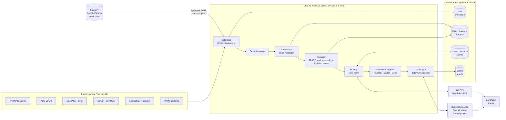

# Moria: a data-mining system for IP Australia's strategic foresight

**Design v0.1, 2026-10-09. Status: proposed. The owner decides whether to adopt it (D-001).** Nothing is built yet.

Moria mines public data about the world around Australia's IP system. It turns what it finds into three
strategy products: a **PESTLE** scan, a **SWOT** (with TOWS options) and a **Futures Cone**. Every statement in them
traces back to the evidence behind it. It runs as a quarterly cycle based on CRISP-DM, the standard data-mining
process. It uses scikit-learn for the mining, **Jev** for high-volume typed judgements, and a generative model for the
writing. Storage is Cloudflare R2 and compute is the Google Compute Engine free tier.

This document follows the owner's SOP (`sop-agent-construction-v2.md`) and reuses the source catalogue and provenance
model in `Access-architecture-and-reusable-adapters.md`.

---

## Contents

0. [Summary](#0-summary) · 1. [Assumptions and scope](#1-assumptions-and-scope) ·
2. [Method: CRISP-DM as the scan cycle](#2-method-crisp-dm-as-the-scan-cycle) ·
3. [Architecture](#3-architecture) · 4. [Sources, by PESTLE dimension](#4-sources-by-pestle-dimension) ·
5. [Data model](#5-data-model) · 6. [Pipeline stages](#6-pipeline-stages) ·
7. [The mining layer (scikit-learn)](#7-the-mining-layer-scikit-learn) ·
8. [Jev and the generative models](#8-jev-and-the-generative-models) ·
9. [The three frameworks](#9-the-three-frameworks) · 10. [How we know: evaluation](#10-how-we-know-evaluation) ·
11. [Security, privacy and governance](#11-security-privacy-and-governance) · 12. [Build order](#12-build-order) ·
13. [Flags](#13-flags) · 14. [For the owner](#14-for-the-owner) · 15. [References](#15-references)

---

## 0. Summary

**What it produces.** Each quarter a *scan* answers one or more strategic questions, such as "How could AI change
the demand for, and the administration of, IP rights in Australia between 2026 and 2036?" A scan has three outputs:

| Product | What the data contributes | What people contribute |
|---|---|---|
| **PESTLE** | Themes found by mining each dimension, with their trends, momentum, breadth across sources, and evidence | Reviewing and merging the drivers, and naming them |
| **SWOT + TOWS** | Strengths and weaknesses measured from IP Australia's own open data against peer offices; opportunities and threats from the PESTLE drivers; candidate pairings | Confirming each quadrant and choosing the strategic options |
| **Futures Cone** | *Projected* and *probable* futures from backtested forecasts with intervals; *plausible* scenarios built on data-selected critical uncertainties; *possible* futures from weak signals | The *preferable* future, which is a leadership choice and is never mined |

**The shape, in five lines:**
1. Collectors on a free-tier VM pull public sources through a handful of protocol adapters.
2. Raw responses go into an immutable store on R2, with their provenance.
3. A security sweep runs, then normalisation turns everything into one evidence schema (documents, observations,
   IP-rights records) in Parquet.
4. scikit-learn mines it: it classifies, clusters, finds topics, flags anomalies, tests trends and forecasts.
   Jev answers typed questions per item (relevance, PESTLE dimension, opportunity or threat, impact, horizon), with
   calibrated probabilities.
5. Framework engines assemble the PESTLE, SWOT and cone. A generative model writes them up, and a deterministic check
   proves every claim and number against the evidence.

**It fits the free tiers. This was measured, not assumed** (§3.2). On this session's CPU, every planned workload
peaked at 206 to 462 MB of memory, within the e2-micro's 1 GB, provided jobs run one at a time. One topic-model
setting (hashed features) peaked at 844 MB, so the design caps vocabularies. Year-1 storage is an estimated 4 to 6 GB,
inside R2's 10 GB free.

**Expected running cost:** about $0 to $4 a month for infrastructure; about $10 to $25 of model APIs per quarterly
scan; about $50 one-off for the historical backfill and the first scan (§3.5). All are estimates: every paid command
does a dry run before it spends.

**I recommend** building a thin slice first: one strategic question (AI and the IP system), with Tier 1 sources only,
through to one complete scan. After that, broaden the sources and questions. The build order is in §12, and the seven
decisions I need from you are in §14.

---

## 1. Assumptions and scope

**Assumptions** (tell me if any is wrong):
- **"Jev" is TypeSafe's Jev.** It is a transformer *decision* model, released in mid-September 2026. It takes a text
  and typed questions (yes/no, choice, score) and returns answers with probabilities and a confidence value. It
  cannot generate text, so the writing needs a separate generative model (§8).
- **The users are people:** IP Australia's strategy and policy analysts, and the executives who read their products.
  Other agents may call it later. The outputs are structured JSON first, so that later use stays open.
- **Public data only.** Everything Moria touches is published open data or public web content. This is what makes a
  US-hosted free tier acceptable (§11).
- **Horizon:** now to 2036, in three bands: H1 = 0 to 2 years, H2 = 2 to 5 years, H3 = 5 to 10 years and beyond.

**In scope:** collection, storage, mining, the three frameworks, the reports, and the evaluation that shows how far each
output can be trusted.

**Not in scope:**
- IP Australia's internal or non-public data.
- Any decision about an individual application or applicant.
- Replacing the human parts of foresight: workshops, stakeholder input, judgement on values.
- Choosing the preferable future.
- A web application. Reports are files; a dashboard can come later.

---

## 2. Method: CRISP-DM as the scan cycle

CRISP-DM (the Cross-Industry Standard Process for Data Mining) has six phases. Each scan runs all six. Each phase ends
in an artefact, and some phases end in a gate where a person approves before the next phase uses the result.

| CRISP-DM phase | What Moria does | Artefact | Gate |
|---|---|---|---|
| 1. Business understanding | Fixes the strategic questions, IP Australia's objectives (from the Strategic Corporate Plan 2026–27: Impact, Customer, Capability, Innovation), the PESTLE codebook, and what a useful answer looks like | `config/questions.yaml`, `config/codebook.yaml`, the Jev question set | **Owner** approves the questions and the codebook |
| 2. Data understanding | Takes an inventory and a census of each source: counts, fields, dates, licences, gaps. Profiles data quality | `reports/sources/*.md` | — |
| 3. Data preparation | Collects, sweeps, normalises, resolves entities, builds features (TF-IDF, embeddings, indicator series) | Parquet in `lake/` and `features/`, with manifests | — |
| 4. Modelling | Mines the data: classification, clustering and topics, trend tests, anomaly and novelty detection, association rules, lead–lag analysis, forecasting | Model cards, labels, topics, signals | Measured choices go to the **owner** for adoption (§10) |
| 5. Evaluation | Checks each model against a yardstick fixed in advance: a gold set, backtests, a hindsight test, and analyst review of samples | `reports/eval/*.md` | — |
| 6. Deployment | Runs the framework engines and the write-up with its check, publishes the scan, and monitors for drift until the next cycle | `scans/<scan_id>/` (PESTLE, SWOT, cone: JSON, Markdown, charts) | **Analysts** review drivers, the SWOT and the scenarios in a workshop |

**The classic data-mining tasks, and the framework each one feeds:**

| Task | Technique | Feeds |
|---|---|---|
| Classification | Jev typed questions; scikit-learn linear models, distilled from Jev and gold labels | Relevance; PESTLE dimension; opportunity or threat; impact, horizon, uncertainty |
| Clustering and topics | Embeddings with MiniBatchKMeans or HDBSCAN; NMF on TF-IDF | PESTLE themes and drivers |
| Trend analysis | Theil–Sen slope with its confidence interval, Mann–Kendall test, Holm adjustment | Trend strength; *probable* future |
| Anomaly and novelty detection | IsolationForest and LocalOutlierFactor on embeddings against a trailing reference window | Weak signals: the *possible* future |
| Association rules | Support, confidence and lift on co-classification (IPC pairs, Nice-class sets), in SQL | Technology convergence and new business-model signals |
| Sequential patterns | Cross-correlation lags between source families (papers → patents → news → policy) | Leading indicators; signposts |
| Regression and forecasting | Seasonal-naive and ETS baselines; quantile gradient boosting; rolling-origin backtests | *Projected* and *probable* bands; scenario ranges |
| Benchmarking | Peer-office clustering, percentile ranks, trend tests on KPIs | Strengths and weaknesses |

---

## 3. Architecture



### 3.1 Where things run

| Component | Where | Why |
|---|---|---|
| Scheduler, collectors, sweep, normalisation, mining, engines, write-up | **GCE e2-micro** (2 shared vCPUs at 0.25 vCPU sustained, 1 GB RAM, 30 GB standard disk), **us-west1** (Oregon) | It is the free tier. Of the three free regions, Oregon is the closest to Australia. |
| System of record: raw, lake, labels, models, scans, manifests | **Cloudflare R2**, one bucket `moria`, with a token scoped to it | Free egress means the VM, analysts and later tools read it at no cost. The VM's disk is only a cache, so the VM can be rebuilt at any time. |
| Global patent aggregates | **BigQuery** (Google Patents Public Datasets) | 1 TiB of queries a month is free. Moria only runs aggregate queries, each capped by `maximum_bytes_billed` and estimated by a dry run first. |
| Typed decisions | **Jev API** (`POST https://api.typesafe.ai/v1/systemone`, as reported by third parties; to confirm) | Calibrated probabilities at about $0.042 per million input tokens, with free output (reported price) |
| Writing and judging | **OpenAI** writes; **Gemini** judges (or the reverse) | A judge never shares the writer's model family (SOP §12) |
| Tracing | **Langfuse** | SOP convention D-045/D-056. Jev calls are traced per batch, and per-item labels go in Moria's own store. |
| Secrets | GCP Secret Manager (inside its free tier), or a root-only `.env` | SOP §22 |

**Software:** one Python 3.11 package, `moria`, managed with uv (lockfile committed), with a typer CLI named `moria`.
Config is YAML validated by pydantic, and unknown keys are errors. Main libraries: scikit-learn, scipy, statsmodels,
DuckDB, pyarrow, httpx, the pinned provider SDKs, and langfuse. fastembed is an optional extra.

**Deployment:** a startup script installs uv, checks out a pinned git tag, runs `uv sync --frozen`, and installs the
systemd units. No inbound ports are open. SSH goes through IAP TCP forwarding with OS Login. OS patches install
unattended.

### 3.2 Fitting the free tiers (measured)

`scripts/memprobe.py` measures peak memory for each planned workload, each in its own process. These are the numbers
from this session's machine (Xeon at 2.8 GHz, BLAS limited to 2 threads, Python 3.11.17, scikit-learn 1.9.1, DuckDB
1.5.6, pandas 3.0.6, pyarrow 26.0.0, fastembed 0.9.0). The data is synthetic, at the planned scale. Each workload
imports only what its real job would (numpy, pyarrow and its own tools); the first row loads the whole stack at once:

| Workload | Peak memory | Time here |
|---|---|---|
| Imports only (scikit-learn, pandas, pyarrow, DuckDB) | 206 MB | 2.1 s |
| Text classifier: 200k documents streamed (`HashingVectorizer` 2^20 + `SGDClassifier.partial_fit`) | 264 MB | 40 s |
| `MiniBatchKMeans` (k = 200) on 200k × 384 vectors streamed, then `IsolationForest` on 50k | 287 MB | 10.9 s |
| Topics: `MiniBatchNMF`, 50 topics, 100k documents, 20k-term TF-IDF vocabulary | 294 MB | 43.6 s |
| Topics: the same with 2^18 hashed features | **844 MB** | 244 s |
| DuckDB: a 20M-row Parquet file, group-by and median, `memory_limit = 300MB` | 286 MB | 6.1 s |
| `HDBSCAN` on 20k points after PCA to 20 dimensions | 257 MB | 34.5 s |
| Local embeddings: `bge-small-en-v1.5` (ONNX through fastembed), texts of about 80 tokens | 462 MB | 18.1 texts/s on 1 thread |

Repeat runs varied by about 10%: DuckDB peaked at 261 to 286 MB, and embedding ran at 18.1 to 19.4 texts/s.

**Rules that follow from these numbers:**
- **One job at a time.** Jobs are serialised with `flock`, and each systemd unit has `MemoryMax=700M`. The OS takes
  about 200 to 300 MB of the 1 GB.
- **A 2 GB swap file is a safety net, not working memory.** A job that swaps is a bug, and it is reported.
- **Stream in batches of 10k or fewer.** Use the `partial_fit` estimators: SGD, MiniBatchKMeans, MiniBatchNMF, online
  LDA, IncrementalPCA.
- **Cap vocabularies at 20k terms**, fitted on a sample. Never fit a dense model over a hashed feature space. That was
  the one failure above.
- **DuckDB runs with `memory_limit='300MB'`**, spills to disk, and reads Parquet straight from R2 through
  `CREATE SECRET (TYPE r2, …)` and `r2://` paths.
- **HDBSCAN on samples of 20k or fewer;** the remaining points are assigned to the nearest cluster centre.
  Vectors are stored as float16 and computed in float32.

**CPU caveat:** the e2-micro sustains 0.25 vCPU, against the 2 dedicated threads here. Expect jobs to take roughly
4 to 8 times as long. Weekly embedding of about 5k items is about 20 minutes, which is acceptable for batch work. Phase 0
re-runs the probe on the real VM, because that machine's numbers are the ones that count (SOP §24).

**Where the other free-tier limits bite:**

| Limit | Moria's load (estimate) | How the design stays inside it |
|---|---|---|
| R2: 10 GB-month | 4 to 6 GB in year 1 (IP RAPID base about 1.5 GB plus weekly deltas about 1 GB a year; documents 0.5 to 1 GB; embeddings about 0.2 GB; raw envelopes 1 to 2 GB) | **Aggregate at the source**: counts by topic × year × country from OpenAlex, BigQuery and GDELT, plus capped samples of records, never mirrors. Parquet with zstd. IP RAPID kept as one base snapshot plus weekly change-sets. |
| R2: 1M Class A (writes) and 10M Class B (reads) a month | About 3k writes and under 1M reads | Responses are bundled into one compressed JSONL object per source per run, never one object per response. Caches are Parquet segments. |
| GCP egress: 1 GB a month free, from North America, **excluding Australia** | 0.3 to 1 GB a month of uploads to R2 | Upload only compressed, derived data and deltas. Meter bytes per job in its manifest. Reports are served from R2, never from the VM, so readers in Australia cost nothing. |
| BigQuery: 1 TiB of queries a month | A few aggregate queries a quarter | Select only the needed columns, dry-run every query, and set a hard `maximum_bytes_billed` per query in config |

### 3.3 Storage layout on R2

```text
moria/
  raw/<source>/<yyyy>/<mm>/<dd>/<run_id>.jsonl.zst     # request/response envelopes; immutable (bucket-lock rule if the plan allows)
  raw/ip_rapid/<release_date>/manifest.json             # SHA-256 of each weekly zip and member; base snapshot quarterly
  lake/documents/family=<f>/month=<yyyy-mm>/part-*.parquet
  lake/observations/series=<id>/vintage=<date>/part.parquet   # vintages kept: statistics get revised
  lake/ip_rapid/base=<date>/<table>.parquet  +  lake/ip_rapid/delta=<date>/<table>.parquet
  lake/evidence/part-*.parquet                          # the provenance envelope for every item (§5)
  features/embeddings/model=<m>/month=<yyyy-mm>/part.parquet
  labels/<backend>/<question_set_version>/part-*.parquet   # Jev, scikit-learn, LLM and human labels; caches by key
  models/<name>/<version>/{model.joblib, card.json}     # loaded only if the SHA-256 matches the manifest
  scans/<scan_id>/{pestle,swot,cone}.json  report.md  report.html  charts/
  manifests/<command>/<run_id>.json
```

### 3.4 Scheduling (systemd timers; UTC)

| Cadence | Jobs |
|---|---|
| Daily | Feeds and incremental APIs (GDELT, government RSS, OpenAlex and arXiv new works, legislation and Hansard changes), then the sweep and normalisation |
| Weekly | IP RAPID refresh, unzipped one member at a time and converted to Parquet; ABS releases; Jev labelling of the week's new items; embeddings; a signals digest |
| Monthly | Incremental topic update, trend statistics, forecast refresh, drift checks on label and topic distributions |
| Quarterly | The scan: framework engines, write-up, check, judge, report, then the analyst workshop. The April–June scan is timed to feed the Corporate Plan, which is published around September. |

### 3.5 Costs

| Item | Monthly, steady state | Notes |
|---|---|---|
| e2-micro VM and 30 GB standard disk | $0 | Free tier, us-west1 |
| External IPv4 address | about $3.65 *(unverified)* | In-use external IPv4 is billed at $0.005 an hour, and I found no statement that the free tier waives it. Check the SKU on the first bill. |
| GCP egress | $0 to $0.20 | 1 GB free; uploads to R2 |
| R2 | $0 | Under 10 GB and well under the operation limits in year 1. Beyond that, $0.015 per GB-month. |
| BigQuery, Secret Manager | $0 | Inside their free tiers, with caps |
| Model APIs | **$10 to $25 per quarterly scan** | See below |
| One-off: backfill and the first scan | **about $50** | 2 to 3 years of text, 10+ years of counts |

**Model volumes per quarterly scan** (prices to be confirmed on the providers' pages before anything is configured,
SOP §14.1):
- **Items:** about 60k new text items: mostly titles and abstracts, about 300 tokens each, so about 18M tokens.
- **scikit-learn relevance pre-screen:** about $0. It removes most of the high-volume news before Jev sees it.
- **Jev:** a two-stage question set (§8.1) of about 600 to 1,100 billed tokens per item, so 20 to 66M tokens, which is
  **about $1 to $3** at the reported price. Whether the state text is billed once per request or once per question is
  not confirmed, and the dry run will show it.
- **Embeddings:** local, so $0. The API fallback would be well under $5.
- **Generative models:** topic naming about 1.5M input tokens; write-ups about 3M input and 0.3M output; judging about
  2M input. That is **$5 to $20**, depending on the models chosen (SOP §14.3 heuristics).

**Money rules (SOP §14.1):**
- Every paid command has `--dry-run`, `--confirm`, and `--limit N --confirm` for a smoke test.
- Budgets live in config and the code enforces them.
- Every paid response is cached under a key covering the text hash, the question-set or prompt version, and the model.
- Billing alerts: GCP budget alert at $5 a month. Cloudflare usage is checked weekly from its analytics API, because
  R2 has no spending cap.

---

## 4. Sources, by PESTLE dimension

**Principle: normalise protocols, not providers** (from the Access architecture document). Tier 1 needs seven
adapters: `bulk` (zip or CSV), `sdmx`, `rest`, `oaipmh`, `rss`, `bigquery` and `html`. Each new source is
configuration plus a parser, not a new service.

**The PESTLE codebook, tailored to IP** (v1; the owner approves it in Phase 1):

| Dimension | What counts, for IP Australia |
|---|---|
| **Political** | Government priorities and programmes; parliament; international relations and treaties; FTA IP chapters (for example GIs under the Australia–EU FTA); WIPO diplomacy; technology geopolitics and economic security |
| **Economic** | Growth, productivity and R&D investment; business formation; trade and IP royalty flows; exchange rates (which drive non-resident filing); fees and the cost of rights; industry structure |
| **Social** | Demographics and skills; attitudes to creators and IP; First Nations knowledge and culture; consumer harm (counterfeits, scams); SME awareness; changes in how people work |
| **Technological** | Emerging technologies (AI, quantum, biotech, clean energy); automation of examination and service delivery; technology-driven shifts in filing behaviour |
| **Legal** | IP legislation and regulation; court decisions; international harmonisation (PCT, Madrid, Hague, PLT); enforcement; AI and inventorship or copyright; privacy and data law |
| **Environmental** | Climate and the net-zero transition (green-technology patents through WIPO's IPC Green Inventory); environmental regulation; genetic resources (the WIPO GRATK treaty); climate-adapted plant varieties (PBR) |

**Tier 1, the pilot.** Access and licence for each source are confirmed in Phase 0, as the SOP's §15.1 inventory
requires:

| Source | Dimensions | Access | What Moria takes |
|---|---|---|---|
| **IP RAPID** (IP Australia; successor to IPGOD; weekly; CC BY 4.0; `IPRAPID.zip` 1.35 GB, refreshed 2026-10-05) | Internal (S/W); T; E; Economic demand | `bulk` from data.gov.au | Six tables: `application`, `party-activity`, `application-links`, `application-events`, `application-classification`, `application-description`. Covers patents, trade marks, designs and PBR, with IPC and Nice classes, WIPO's 35 technology fields, event dates, PCT and Madrid links, and harmonised party names with ABNs. |
| **ABS Data API** | E; S | `sdmx` | Business R&D, business counts, trade in services including charges for the use of IP, labour, population |
| **OpenAlex** | T; S; E | `rest` (key; metered) | Counts by topic × year × country via `group_by`. Abstracts of Australian-affiliated and pilot-topic works for text mining. |
| **Google Patents Public Datasets** | T; E | `bigquery` | Global filings by CPC/IPC × office × year; first-seen code pairs. Aggregates only. |
| **WIPO IP Statistics Data Center** | Internal benchmarking; E | `bulk` (CSV) | Office-level filings, resident and non-resident shares, and growth, for peer offices |
| **GDELT DOC 2.0 API** | P; S; T; L; E | `rest` | Article metadata and titles for IP and innovation queries, Australian and global. **Titles only**, so publishers' text is never stored. |
| **Federal Register of Legislation** | L; P | `rest` or `rss` (to confirm) | IP Acts and regulations; changes and new instruments |
| **Parliament: Hansard and Senate Estimates** | P; L | APH, or the OpenAustralia API (non-commercial terms; to confirm) | Debates and Estimates passages that mention IP Australia or the IP system |
| **IP Australia publications** | Internal (S/W); all | `html` and PDF | Strategic Corporate Plan, Annual Report (performance results), Australian IP Report, consultations, news |
| **arXiv** | T | `oaipmh` | New submissions in the pilot topic's categories |

**Tier 2, after the pilot**, mostly from the Access architecture document's catalogue:
- patents: EPO OPS, USPTO ODP;
- foreign law and regulation: EUR-Lex, the US Federal Register, Regulations.gov;
- macro context: OECD, IMF, World Bank, UN Comtrade;
- environment: Copernicus, NOAA, Australian energy statistics;
- government demand: AusTender;
- early signals: Media Cloud, Bluesky Jetstream, Hacker News, GitHub;
- courts: Federal Court judgments, and AustLII **only with its permission**, since its terms restrict automated bulk
  access;
- WIPO Lex and the Global Innovation Index.

---

## 5. Data model

**The evidence object is the unit**, not a chunk of text. Its envelope is the Access architecture document's
provenance model, trimmed to what Tier 1 needs:

| Field | Meaning |
|---|---|
| `evidence_id` | SHA-256 of `provider` + `provider_record_id` + `content_hash`: stable across runs |
| `provider`, `source_collection`, `provider_record_id` | The canonical producer, the dataset and the upstream id (DOI, application number, URL, series code) |
| `kind` | `document` (text), `observation` (a time-series point) or `ipr_record` (an IP RAPID row) |
| `family` | `research`, `patent`, `policy`, `legal`, `news`, `social`, `statistics` or `ipa_internal` |
| `retrieval_method`, `request_hash`, `tool_identity` | Adapter, normalised request, and adapter version |
| `provider_published_at`, `provider_updated_at`, `retrieved_at`, **`first_seen_at`** | Event time, revision time, retrieval time, and the first time Moria saw it. A first sighting is a signal in its own right. |
| `raw_object_uri`, `raw_content_hash` | A pointer into `raw/` and its hash |
| `licence` | Licence and redistribution limits, per source |
| `parser_version` | Separates changes at the source from changes in extraction |
| `security` | The sweep's findings (§11) |

**Analytical tables** (Parquet, queried with DuckDB):

| Table | Holds |
|---|---|
| `documents` | Cleaned text, title, language, country, family, dates |
| `observations` | `series_id`, `period`, `value`, `unit`, `vintage` |
| `ipr_*` | The IP RAPID tables, plus derived `ipr_metrics` (demand, timeliness, outcomes; §9.2) |
| `labels` | `evidence_id`, `backend`, `question_id`, `question_set_version`, `model_version`, `answer`, `probabilities`, `confidence` |
| `embeddings` | `evidence_id`, `model`, `vector` (float16) |
| `topics`, `doc_topics` | A topic model's run id, top terms, label and size, and each document's weights |
| `signals` | `signal_id`, `type` (`emerging_topic`, `indicator_trend`, `novelty`, `new_combination`, `burst` or `event`), metrics, `first_detected`, evidence ids |
| `drivers` | Statement, PESTLE dimensions, stance, impact, uncertainty, horizon, momentum, breadth, confidence, signals, evidence, review status |
| `claims` | A synthesised proposition, with citations (`evidence_id` and quote or locator) and stance (supports, contradicts or contextualises) |
| `scans` | `scan_id`, `as_of`, questions, config hash, outputs |

**Evidence → signal → trend → driver.** A *signal* is a detected pattern. A *trend* is a signal with a statistically
supported direction over time. A *driver* is a reviewed cluster of trends and signals that could affect IP Australia's
objectives. Every driver keeps links down to its evidence.

**Point in time.** Every scan takes an `as_of` date and reads only evidence with `first_seen_at <= as_of`, so a scan
can be reproduced exactly. History filled in by the backfill has `first_seen_at` equal to the backfill date, so
hindsight tests use `provider_published_at` instead. That carries a revision bias, which they disclose (§10).

---

## 6. Pipeline stages

Every stage follows the SOP's §16.1 stage contract:
- one module and one command per stage;
- it reads only verified upstream outputs;
- writes are atomic, and the stage is idempotent;
- every run writes a manifest and a report;
- failure is loud: exit code 2.

| Stage | Command | Reads | Writes | Spends |
|---|---|---|---|---|
| Collect | `moria collect <source>` | Source APIs and files | `raw/` | BigQuery bytes (capped) |
| Sweep | `moria sweep` | `raw/` | Findings; quarantine | — |
| Normalise | `moria normalise` | Swept raw data | `lake/` | — |
| IP RAPID | `moria ipr refresh`, `moria ipr metrics` | Weekly zip | `lake/ip_rapid/`, `ipr_metrics` | — |
| Features | `moria features tfidf\|embed` | `lake/documents` | `features/` | — (local embeddings) |
| Label | `moria label --backend jev\|sklearn\|llm` | Documents | `labels/` | Jev or LLM tokens |
| Mine | `moria mine topics\|trends\|signals\|rules\|leadlag\|forecast` | Lake, features, labels | `topics`, `signals`, model cards | — |
| Engines | `moria engine pestle\|swot\|cone --scan <id>` | Mined outputs | `drivers`, framework JSON | — |
| Write-up | `moria write --scan <id>` | Framework JSON, evidence | `report.md`, `claims` | LLM tokens |
| Check | `moria check --scan <id>` | The report, `claims`, the ledger, metrics | Check results | — |
| Judge | `moria judge --scan <id>` | The report (wrapped as data) | Rubric scores | LLM tokens (the other family) |
| Scan | `moria scan --question <id> --as-of <date>` | Everything above, in order | `scans/<id>/` | The sum of the above |
| Eval | `moria eval labels\|topics\|forecast\|hindsight` | Gold sets, backtests | `reports/eval/` | Jev or LLM tokens for candidates |

---

## 7. The mining layer (scikit-learn)

| Job | Method | scikit-learn (and helpers) | Memory-safe form |
|---|---|---|---|
| Relevance pre-screen | A linear classifier on hashed n-grams, trained on gold and Jev labels | `HashingVectorizer`, `SGDClassifier(loss="log_loss")` | `partial_fit` in batches (264 MB measured) |
| Distilled labellers (a candidate in §8.2) | One classifier per question, TF-IDF or embedding features | `TfidfVectorizer(max_features=20000)`, `LogisticRegression`, `OneVsRestClassifier` | Vocabulary fitted on a sample |
| Calibration | Mapping Jev's and the classifiers' probabilities onto observed frequencies | `IsotonicRegression`, `CalibratedClassifierCV`, `calibration_curve`, `brier_score_loss` | Small |
| Themes | Embedding clusters, and NMF topics for readable term lists | `MiniBatchKMeans`, `HDBSCAN`, `MiniBatchNMF`, `TruncatedSVD` | `partial_fit`; HDBSCAN on samples of 20k or fewer |
| Choosing k and checking stability | Silhouette on a sample; agreement across seeds | `silhouette_score`, `adjusted_rand_score` | Sample |
| Trend tests | Theil–Sen slope and its CI on monthly shares; Mann–Kendall; Holm adjustment | `scipy.stats.theilslopes`, `kendalltau`; statsmodels `multipletests` | Series are small |
| Bursts | Poisson surprise of the latest window against the trailing rate | scipy | Small |
| Novelty | Distance of new items from a trailing three-year reference | `IsolationForest`, `LocalOutlierFactor(novelty=True)` | 287 MB measured with k-means |
| New combinations | First-seen IPC subclass pairs and Nice-class sets; lift | DuckDB SQL | 286 MB measured |
| Lead–lag | Cross-correlation of a topic's monthly series across families | numpy and statsmodels `ccf` | Small |
| Forecasts | Seasonal naive and ETS baselines; quantile gradient boosting with lags and drivers | statsmodels `ETSModel`; `HistGradientBoostingRegressor(loss="quantile")`; `TimeSeriesSplit` | Small |
| Peer benchmarking | Clustering offices on standardised KPI profiles; percentile ranks | `StandardScaler`, `KMeans`, `NearestNeighbors` | Small |
| Model selection | Fixed grids under the SOP's rule: "simplest within a tie margin of the best dev score" | `GridSearchCV` with a custom refit rule | — |

**Emergence score**, for ranking themes and signals:
- growth (the Theil–Sen slope of log share);
- acceleration;
- novelty;
- breadth (the number of source families with a positive slope);
- lead (whether research or patents lead the news).

Each is turned into a percentile rank, and they are combined with weights held in config. The report shows the
ranking's sensitivity to those weights, so no single arbitrary weighting decides the order.

---

## 8. Jev and the generative models

### 8.1 Jev: typed decisions

Jev takes a *state* (the item's text, defanged and wrapped as data) and a set of typed questions. Per third-party
write-ups (to confirm against TypeSafe's docs in Phase 0), there are three kinds:
- `noul`: yes or no, returning a probability;
- `choice`: up to 255 options, with criteria;
- `score`: ordered levels.

Each answer comes back with per-option probabilities and a confidence value. The state plus the longest question must
fit within 32k tokens. The question set is versioned and locked like a prompt (`prompts/jev/questions-v1.yaml`).

**Stage A, for every item that passes the scikit-learn pre-screen:**
- `relevant` (noul): "Could this development plausibly affect Australia's IP system, IP Australia, or the people and
  businesses who use IP rights in Australia, within ten years?"
- `pestle_political` … `pestle_environmental` (six nouls, from the codebook's definitions). These are independent
  probabilities, because an item can belong to several dimensions.

**Stage B, only for items with P(relevant) at or above the threshold set on the dev set:**
- `stance` (choice: opportunity, threat, both, neither), relative to IP Australia's stated purpose;
- `impact` (score: negligible, minor, moderate, major, transformative);
- `horizon` (choice: H1, H2, H3);
- `settledness` (score: from "contested or unknown" to "settled"), which feeds uncertainty;
- `signal_kind` (choice: event, trend, forecast or opinion, weak signal, not a development);
- `rights_patents`, `rights_trade_marks`, `rights_designs`, `rights_pbr` (four nouls), which link drivers to internal
  metrics for TOWS.

**How the probabilities are used:**
- Volumes are *expected* counts. A theme's PESTLE weight is the sum of P(dimension) × P(relevant) over its items.
- Thresholds apply only where a yes or no is unavoidable, such as which items enter a report.
- Impact is the expected level: the sum of level × probability.
- That makes calibration matter, so it is measured and corrected (§8.2).

**Jev is used only behind an adapter.** Access is early, signups were reported paused on 22 September, and its
benchmarks are the vendor's own. The `label` stage therefore has three backends with one contract: `jev`, `sklearn`
and `llm`. Moria works, and is measured, without Jev.

### 8.2 Choosing the labeller by measurement

This is fixed in advance, in the commit that adds the gold set (SOP §12):

- **The gold set:** 600 items, 100 from each of six families. Two analysts label a 20% overlap, and Cohen's kappa is
  reported as the gold set's error bar. Disagreements are adjudicated.
- **The split:** dev and test halves, by hashed id.
- **Candidates, simplest first:**
  1. scikit-learn trained on gold dev only;
  2. Jev zero-shot;
  3. Jev with isotonic calibration fitted on dev;
  4. scikit-learn distilled from about 20k Jev "silver" labels;
  5. a small LLM, zero-shot (the fallback if there is no Jev).
- **Metrics:**
  - macro-F1 per question, at thresholds chosen on dev;
  - PR-AUC;
  - **Brier score and expected calibration error (ECE)**, which measure whether "70%" comes true about 70% of the
    time;
  - the cost per 1k items, reported beside quality.
- **The rule:** the simplest candidate within 0.02 macro-F1 of the best on dev, with ECE of 0.05 or less after
  calibration. The result is reported on test with bootstrap 95% intervals.
- **Precision:** with 300 test items, the standard error of an F1 is about 0.025 to 0.03. Gaps under about 0.06
  can't be separated. If a decision hinges on a smaller gap, the set grows.
- The result is a recommendation; the owner adopts the labeller (SOP §5).

### 8.3 Generative models: naming, writing, narratives

Jev can't write, so a generative model does these four jobs:
- naming topics, from their top terms and representative items;
- drafting driver statements;
- proposing TOWS options and wildcards;
- writing scenario narratives and the scan report.

**Each output is checked before anyone sees it.** It follows the SOP's answer structure: prose with `[n]` markers,
claims, citations, and gaps. A deterministic **check** confirms:
- every cited `evidence_id` was shown to the model;
- every quote is verbatim, and substantial;
- **every number in the prose appears in the metrics JSON the model was given**. This number check is new for Moria:
  trends and forecasts are never invented in the writing;
- the coverage agrees with the claims and gaps.

A failed check is retried once, with its errors wrapped as data. An answer that still fails is shipped flagged, never
passed silently.

**A judge from the other model family** grades each report, blind to the writer. Its rubric: grounded, balanced (does
it report contrary evidence?), specific to IP Australia, and distinct (are drivers repeated?).

### 8.4 Model roles

| Work | Model class (SOP §14.3) |
|---|---|
| High-volume typed decisions | Jev, or a small cheap LLM behind validation, as chosen in §8.2 |
| Bulk relevance pre-screen | scikit-learn |
| Embeddings | Local `bge-small-en-v1.5` (MIT licence, pinned revision, no `trust_remote_code`) |
| Topic naming | A small model |
| Write-ups, TOWS options, scenario narratives | A strong model at medium effort |
| Judge | The other family |

---

## 9. The three frameworks

### 9.1 PESTLE engine

1. **Gate:** the scikit-learn pre-screen, then Jev's `relevant`.
2. **Dimension:** Jev's six `pestle_*` probabilities.
3. **Themes per dimension:**
   - candidates are k-means and HDBSCAN on embeddings, and NMF on TF-IDF;
   - one is chosen by coherence (NPMI: how often a topic's top words occur together), stability across seeds (ARI)
     and an analyst word-intrusion test (§10);
   - the generative model names each theme.
4. **Theme time series:** monthly expected counts and shares, split by source family.
5. **Trend statistics:**
   - Theil–Sen slope with its CI, and Mann–Kendall with Holm adjustment across themes;
   - bursts;
   - breadth across families;
   - lead–lag between families. For example, "research leads Australian patent filings by about N months" becomes a
     leading indicator.
6. **Indicators:** structured series mapped to dimensions. For example, business R&D (Economic); IP RAPID filings by
   technology field (Technological); green-inventory IPC filings (Environmental).
7. **Drivers:** themes and indicators that move together are merged into candidate drivers. Each is ranked by the
   emergence score and expected impact, and the generative model drafts a cited statement for it.
8. **Review:** analysts merge, split, rename and adopt drivers. Their edits are recorded, and become training data for
   the next cycle.

**Output:** a PESTLE matrix. For each dimension, the top drivers, each with its trend chart, momentum, breadth,
horizon, confidence and citations.

### 9.2 SWOT engine, with TOWS

**Strengths and weaknesses are internal, measured from open data:**

| Area | Metrics from IP RAPID (fields confirmed in the Phase 0 census) |
|---|---|
| Demand | Applications by right type, applicant origin, route (direct, PCT or Madrid), technology field or Nice class; share with an ABN |
| Timeliness | Days between key events in `application-events` (for example examination request to first report; filing to acceptance or registration): median and 90th percentile by right type and field; trend |
| Outcomes | Shares accepted or registered, lapsed, withdrawn or refused; opposition rates |
| Capability | Share of classifications made by machine (`classification_source`); self-filed against attorney-filed |
| Peers | WIPO statistics for peer offices; the peer group is chosen by clustering on size and mix, not by assumption |
| Text | Annual Report results against targets, ANAO audits, Estimates, consultations. Analysed with Jev (strength, weakness or neither) and cited claims. |

**The rule:**
- A *strength* is significantly better than the peer median, or a significant improving trend.
- A *weakness* is the reverse.
- "Significant" means the CI excludes no difference.

Each statement cites its metric and its interval. The thresholds live in config; the owner adopts them.

**Opportunities and threats are external.** They come from the PESTLE drivers:
- Jev's `stance`, aggregated over a driver's evidence;
- ranked by expected impact × momentum × confidence;
- a driver whose evidence is split between "opportunity" and "threat" appears in both quadrants, marked contested.

**TOWS** (the SWOT turned into options):
- Pairs are linked through shared keys: right type, technology field, customer segment.
  For example, a weakness of long pendency in computer technology, paired with a threat of AI-driven filing growth in
  the same field.
- For the strongest S×O, S×T, W×O and W×T pairs, the generative model proposes strategic options, each one cited.
- Analysts choose.

**Output:** the SWOT grid, the TOWS table, and an evidence appendix.

### 9.3 Futures Cone engine

Voros's Futures Cone has these zones: projected, probable, plausible, possible and preferable. The data fills the
first four; people fill the fifth.

| Cone zone | How Moria fills it |
|---|---|
| **Projected** (the baseline) | The median forecast of key indicators: filings by right type and top fields, non-resident share, timeliness, SME share |
| **Probable** | The forecast's 50% interval. The model is chosen by rolling-origin backtest on MASE (error against a naive forecast) and on interval coverage. |
| **Plausible** | Scenarios (method below), plus the 80% and 95% statistical bands |
| **Possible** | Weak signals: novel items, small fast-growing themes, first-seen technology combinations, new terms. Plus wildcards: low-probability, high-impact events proposed by the generative model and tied to a signal (or marked "no signal yet"), then curated by analysts. |
| **Preferable** | IP Australia's objectives and leadership's chosen end states. Moria supports **backcasting** here: for each end state it shows the gap between the projected path and the target, the drivers that help or hinder (from the SWOT), and the signposts to monitor. |

**How the scenarios are built:**
1. **Score each driver on impact and uncertainty.**
   - Impact is Jev's expected impact, calibrated, plus analyst adjustment.
   - Uncertainty is computed from the data: inverse settledness; disagreement in stance across the driver's evidence
     (entropy); the relative width of the forecast interval for linked indicators; and disagreement between sources.
   - Each is turned into a percentile rank and averaged.
2. **Plot the impact–uncertainty matrix.**
   - High impact and low uncertainty are *predetermined elements*: they go into every scenario.
   - High impact and high uncertainty are *critical uncertainties*.
3. **Choose the two scenario axes by data:** the pair of critical uncertainties whose driver-strength series are least
   correlated, preferring different PESTLE dimensions. That keeps the 2×2 from collapsing onto one axis. Analysts can
   override the choice.
4. **Write the four scenarios.** The generative model drafts each one from its quadrant's drivers and evidence, and the
   check applies. Each scenario states where key indicators would sit relative to the statistical cone, from analysts'
   directional assumptions. Moria does not pretend to compute scenario probabilities.

**Output:**
- a fan chart per key indicator: the median, the 50/80/95% bands, and annotated scenario positions;
- a cone map placing drivers and signals by horizon and zone;
- the scenario narratives;
- the signpost watchlist, which the weekly digest then tracks.

### 9.4 One driver's journey (illustrative only; no real findings)

1. OpenAlex shows a fast-growing theme on AI-assisted patent drafting.
2. IP RAPID shows filings rising in computer technology.
3. GDELT titles about AI inventorship burst.
4. A legislative change appears on the Federal Register of Legislation.
5. The PESTLE engine merges these into a candidate driver ("AI changes how IP is created and filed"), tagged T, L and P,
   at horizon H1 to H2.
6. Jev's stance splits between opportunity (AI-assisted examination) and threat (volume and quality pressure). The
   driver enters both the O and T quadrants, marked contested, and pairs in TOWS with the timeliness metric for that
   field.
7. In the cone, the field's filings forecast forms the probable band. "Recognition of AI-generated inventions" becomes a
   critical-uncertainty axis. An outlier cluster of AI-generated defensive publications becomes a weak signal in the
   possible zone.

---

## 10. How we know: evaluation

Each yardstick is committed before its numbers exist. Each evaluation chooses on dev and reports on test, with
intervals.

| Component | Yardstick | Pass rule (proposed; the owner adopts it) |
|---|---|---|
| Labellers (§8.2) | Gold set of 600 items; macro-F1, PR-AUC, Brier, ECE | Simplest within 0.02 macro-F1 of the best on dev; ECE ≤ 0.05 |
| Themes | NPMI coherence; stability (mean ARI over 5 seeds); share assigned; analyst word-intrusion test on 20 themes | Simplest within a tie margin; intrusion spotted at least 70% of the time |
| Trends | Holm-adjusted p-values; sensitivity to the window (12, 24 or 36 months) | A trend is reported only if it is significant in at least 2 of the 3 windows |
| Forecasts | Rolling-origin backtest, 2012–2025: MASE, pinball loss, coverage | The 80% interval covers 75–85%; the simplest model within 5% of the best MASE |
| Weak signals | **Hindsight test:** run with an `as_of` date in the past and check that known later developments were flagged. Precision@20 by analyst review. | Proposed: at least half of the known developments flagged 6 or more months before their peak in coverage; precision@20 ≥ 0.3 |
| Write-ups | The deterministic check; the cross-family judge's rubric; analyst review | 100% pass the check after the retry; no grade below 2 of 3 unreviewed |
| The whole scan | Analysts' usefulness rating per driver and option in the workshop | Tracked across cycles; it is the business success criterion from CRISP-DM phase 1 |

**The hindsight set** is chosen by analysts *before* any run. It includes known developments and also non-events, so
that false alarms are counted. Candidate known developments:
- COVID-19-related trade marks and patents (2020);
- virtual-goods and metaverse trade marks in Nice classes 9, 35 and 41 (2021–22);
- generative-AI filings (2022–24).

**Limits, disclosed in every report:**
- Backfilled history uses publication dates, not first sighting, so hindsight tests flatter the system somewhat.
- The probable band assumes the past's patterns persist.
- The LLM-written test material is not real analysts' questions until the workshops supply some.

---

## 11. Security, privacy and governance

**From the SOP (§22), applied here:**
- Everything from a source, from a model or from another tool is untrusted data, never instructions.
- The sweep stage removes active content, marks hidden content, and scans for AI-directed instructions, Unicode
  smuggling, secrets and personal data. High severity quarantines the item; the owner alone approves allowlist entries.
- Prompts and Jev states wrap source text in defanged delimiters.
- Every generated string is re-scanned.
- API clients are pinned, with `store=false` for OpenAI.
- Local models have a permissive licence and a pinned revision, and no `trust_remote_code`.

**Specific to Moria:**
- **Personal information.** IP RAPID's party table includes individuals.
  - Names of parties that are individuals are hashed at ingest.
  - Analysis stays at organisation, sector and country level.
  - No output profiles a person.
- **Pickled models are code.** A `joblib` artefact is loaded only if its SHA-256 matches the manifest Moria wrote.
- **The VM:**
  - no inbound ports; SSH through IAP;
  - the R2 token is scoped to one bucket, read and write;
  - the GCP service account has least privilege (Secret Manager accessor, BigQuery job user);
  - budget alerts are set.
- **Licences, per source in the evidence envelope:**
  - news is stored as titles and URLs only;
  - AustLII is not harvested without permission;
  - OpenAustralia's terms are non-commercial;
  - IP RAPID is CC BY 4.0, so reports attribute it.
- **Data residency.** The free tier is US-only (us-west1), and R2 has no Australian jurisdiction setting. That is
  acceptable only because Moria holds public data. Anything non-public needs an environment the agency approves.
- **AI governance.** If IP Australia adopts Moria's outputs into official strategic planning, it is likely an in-scope
  AI use case under the DTA's *Policy for the responsible use of AI in government* v2.0 (in effect since
  15 December 2025). That brings a use-case owner, an entry in the agency's register, and a risk assessment. Moria
  helps by design:
  - every claim is traceable to evidence;
  - every model choice is measured and recorded;
  - every scan is reproducible from its `as_of` date and manifests;
  - outputs are labelled "machine-assisted analysis: draft for analyst review".

---

## 12. Build order

Each phase is one owner request and one or two sessions, under the SOP's cycle (§2): build, verify without spending,
gate, run, read, record, reply.

| Phase | Work | Checked by | Spend |
|---|---|---|---|
| **0. Kickoff** | Repo skeleton per SOP §15.3 (`CLAUDE.md`, `docs/decisions.md`, config, `prompts/`, CI with no network, hygiene test). VM provisioned by script; R2 bucket and scoped token. Environment check: DuckDB reads and writes `r2://`; Jev `/v1/models`; OpenAI, Gemini and Langfuse auth; BigQuery dry run. `scripts/memprobe.py` on the real VM. Tier 1 inventory and licences. | Green CI; every provider answers; probe numbers recorded | < $0.10 |
| **1. Business understanding** | Strategic-question register; objectives taxonomy from the Corporate Plan 2026–27; PESTLE codebook; Jev question set v1; annotation guide; the hindsight set (chosen by analysts) | **Owner approves** the questions, the codebook and the hindsight set | $0 |
| **2. Data** | Tier 1 adapters and collectors; sweep; normalisation; IP RAPID ingest and `ipr_metrics`; indicators; backfill of counts; data-quality census reports | Fixture tests; real-data runs with manifests; reports read | $0 (BigQuery capped) |
| **3. Labels** | Gold set (about 8 analyst-hours); the labeller measurement (§8.2) | Report with intervals; **owner adopts** a labeller | about $5 |
| **4. Mining** | Embeddings; themes; trends; signals; rules; lead–lag; forecasts, each with its measurement; the hindsight test | Eval reports; **owner adopts** the methods | $5–15 |
| **5. Frameworks and write-up** | PESTLE, SWOT/TOWS and cone engines; write-up with the check; judge; **the pilot scan** on the AI question; analyst workshop | The check at 100%; judge grades; workshop ratings | $10–25 |
| **6. Operate** | Timers; weekly digest; quarterly scans; drift checks; Tier 2 sources added one at a time, each extending the gold and hindsight sets | Each new source re-runs its evaluations (SOP §21.4) | $10–25 a quarter |

**Shape outputs now for later uses, but don't build them yet** (they go under "Future state" in `CLAUDE.md`):
- a question-answering agent over the evidence store (the SOP's agent pattern);
- a dashboard;
- other agents as callers;
- non-English sources;
- an Iceberg catalogue on R2.

---

## 13. Flags

**For you: Jev is early access, and its claims are the vendor's own.**
- Found: signups were reported paused on 22 September 2026. Its benchmarks are on four internal datasets.
- Why it matters: the design leans on its calibrated probabilities.
- Options: (a) proceed with Jev as one of three backends and measure it (§8.2); (b) drop it for a small LLM.
- I recommend (a). It costs nothing if Jev is unavailable, because the fallback is built anyway.
- I need: whether you have an API key.

**For you: the free VM is small and slow, but it is enough.**
- Found: 1 GB of RAM and 0.25 vCPU sustained. The measured peaks are 206 to 462 MB, with one job at a time.
- Why it matters: the backfill (2 to 3 years of text) will take hours to days on the e2-micro.
- Options: (a) run the backfill slowly on the free VM; (b) run it once on a larger VM. If the account is new,
  that is covered by the $300, 90-day trial credit.
- I recommend (a), unless the backfill estimate in Phase 2 exceeds about 3 days.
- I need: nothing now.

**For you: "free" is probably not $0.**
- Found: an in-use external IPv4 is likely about $3.65 a month (unverified for the free tier). Egress over 1 GB a month
  is billed.
- I recommend accepting this, with a $5 a month budget alert.
- I need: a yes.

**For you: residency and policy.**
- Found: the free tier is US-hosted.
- Why it matters: this is acceptable for public data only. If the work becomes official, the DTA AI policy applies.
- I recommend public data only, and keeping the design portable. Everything is Parquet, Python and S3-compatible
  storage, so it can move to an agency-approved environment unchanged.
- I need: confirmation of the public-only scope.

**For you: futures honesty.**
- The probable band is extrapolation, and the preferable zone is leadership's choice.
- Reports will say both, every time.
- I need: nothing.

---

## 14. For the owner

1. **Adopt this design as the basis for Phase 0?** (yes / changes)
2. **Pilot question:** "How could AI change the demand for, and the administration of, IP rights in Australia,
   2026–2036?" (yes / another)
3. **Jev:** do you have API access? (yes / no; if no, the LLM fallback is the starting backend)
4. **Scope:** public data only on this stack? (yes / no)
5. **Budget:** $50 for the backfill and the first scan, then about $25 a quarter; infrastructure alert at $5 a month.
   (yes / amount)
6. **People:** who labels the gold set (about 8 hours) and joins the review workshop (half a day a scan)?
7. **Repo visibility:** private or public? This decides whether gold-set excerpts and reports are committed to git, or
   kept only in R2.

---

## 15. References

- Owner's SOP: `sop-agent-construction-v2.md` (method, records, money rules, security).
- Source catalogue and provenance model: `Access-architecture-and-reusable-adapters.md`.
- IP RAPID, data.gov.au dataset `423000b8-5735-4447-bcb9-792644bcd7ea`, and its data dictionary (IP Australia Centre of
  Data Excellence, 2023-08-01).
- IP Australia, Strategic Corporate Plan 2025–26 and 2026–27 (published 1 September 2026).
- Google Cloud free-tier features (Compute Engine e2-micro, BigQuery, the $300 trial):
  `docs.cloud.google.com/free/docs/free-cloud-features`.
- Cloudflare R2 pricing (10 GB-month, 1M Class A, 10M Class B, free egress), and DuckDB's R2 guide (`TYPE r2` secrets).
- TypeSafe Jev: Browserbase, "What is Jev?" (2026-09-21); DeepLearning.AI, *The Batch* (2026-09-25); third-party API
  guides (endpoint, pricing, the signup pause).
- DTA, *Policy for the responsible use of AI in government* v2.0 (effective 2025-12-15).
- Voros, J. (2003), "A generic foresight process framework", *Foresight* 5(3): the Futures Cone.
- Chapman, P. et al. (2000), *CRISP-DM 1.0: Step-by-step data mining guide*.
- Verhoeven, D., Bakker, J. and Veugelers, R. (2016), "Measuring technological novelty with patent-based indicators",
  *Research Policy* 45(3): recombination as a novelty signal.
