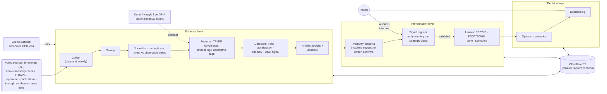

# Moria: a broad signal-detection and validation engine for IP Australia's strategic foresight

**Design v0.3, 2026-10-09; updated 2026-10-10. Status: direction approved by the owner (D-005, D-006), with set-up
items open (§15). It builds on
D-003 and D-004.** Nothing is built
yet. v0.2 (D-002) adopted the alternative view. v0.3 applies the owner's answers:
- one purpose, with two audiences;
- broader than the IP system;
- free options first;
- one week for the machinery.

Moria scans the wider world for change that could reach Australia's IP system over the next ten years. It does not
filter what it collects by IP keywords. Instead, it collects broadly and finds change anywhere, cheaply. Each
candidate signal must then show a **pathway** to the IP system before anyone spends time on it.

Its core is a signal engine:
1. It detects trends, accelerations, anomalies and weak signals.
2. It rules out artefacts: coverage changes, ingestion failures, news cycles, duplicates.
3. It builds an evidence dossier for each candidate.
4. People validate each candidate before anyone interprets it.

PESTLE, SWOT and TOWS, the Futures Cone and scenarios are then lenses over the validated signals. Evidence,
interpretation and decision are kept as separate layers.

**Everything in the machinery is free by default:**
- scikit-learn, DuckDB and open Hugging Face models;
- R2's free tier for storage;
- GitHub Actions (free for this public repo) or the GCE free tier for scheduled jobs;
- free Colab or Kaggle GPUs for optional one-off bursts.

Any paid step is listed with its exact purpose and cost (§4.6), and nothing paid runs without the owner's approval of
that item.

This document follows the owner's SOP (`sop-agent-construction-v2.md`). It reuses the source catalogue and provenance
model in `Access-architecture-and-reusable-adapters.md`.

---

## Contents

0. [Summary](#0-summary) · 0.1 [What changed in v0.3](#01-what-changed-in-v03) ·
1. [Purpose and scope](#1-purpose-and-scope) · 2. [Breadth: rings, pathways and questions](#2-breadth-rings-pathways-and-questions) ·
3. [Method: CRISP-DM in three layers](#3-method-crisp-dm-in-three-layers) · 4. [Architecture and compute](#4-architecture-and-compute) ·
5. [Sources](#5-sources) · 6. [Data model](#6-data-model) · 7. [Pipeline stages](#7-pipeline-stages) ·
8. [The mining layer](#8-the-mining-layer) · 9. [Models: free first](#9-models-free-first) ·
10. [The frameworks as lenses](#10-the-frameworks-as-lenses) · 11. [How we know](#11-how-we-know-evaluation) ·
12. [Security, privacy and governance](#12-security-privacy-and-governance) ·
13. [The one-week machinery sprint](#13-the-one-week-machinery-sprint) · 14. [Flags](#14-flags) ·
15. [For the owner](#15-for-the-owner) · 16. [References](#16-references)

---

## 0. Summary

**What it produces:**
- **The signal register,** the core product. Candidate signals, each with its detectors' numbers, an artefact check,
  its pathway to the IP system, and an evidence dossier. People then validate them and track them over time.
- **Two views of the register, one per audience:**
  - the **early-warning view,** for IPAVentures as the agency's canary: weak signals, low-base surges and novel items,
    shown as soon as they pass the artefact checks;
  - the **strategic view,** for agency strategy: validated trends and drivers.
- **The lenses:** PESTLE (external drivers), SWOT/TOWS, the Futures Cone and 2–3 scenarios, and the robustness of
  options across scenarios.
- **A decision log.**

**The shape:**
1. **Collect broadly.** Three source rings: the IP system, its adjacent fields, and the wider world (§2.1). Big
   sources are read as counts across their whole taxonomy (all research topics, all patent classes, all ABS headline
   series, a broad set of news themes). Texts are taken only where needed.
2. **Store immutably on R2,** with event and observable dates and with provenance.
3. **Mine with scikit-learn and DuckDB:** temporal, semantic, anomaly and relationship analysis.
4. **Detect candidates, check them for artefacts, and build dossiers.**
5. **Map each candidate's pathway to the IP system** (§2.2). Free Jev-class models suggest the pathways, which people
   confirm.
6. **Rank the review queue with quotas per ring,** so neither the IP system nor the wider world crowds out the other.

**Measured on this session's 4-CPU machine** (§4.2):
- every scikit-learn, DuckDB and embedding workload peaked at 206 to 489 MB;
- the free Jev-class decision model (Jev-Style 0.8B) peaked at about 1.7 GB, which does not fit the free 1 GB VM but
  fits a GitHub Actions runner.

**Cost:** $0 for the machinery week with compute option A (§4.1). Paid items only on a specific approval.

**I recommend:**
- build the machinery in one week (§13) as parallel Claude Code sessions;
- start the daily collectors on day 1, because "first seen" dates can't be backfilled;
- use GitHub Actions and R2 as the free core, with free Colab or Kaggle GPUs for optional bursts;
- keep Matilda-Jev as the measured upgrade if the free models fall short on your labels.

What I need from you is in §15.

---

## 0.1 What changed in v0.3

| Owner's answer (D-003) | Change in v0.3 |
|---|---|
| Purpose: both; IPAVentures is the agency's canary | One purpose and one register, with two views: early-warning (IPAVentures) and strategic (agency). The lens decision is gone. |
| One week for the machinery, not six | §13 is a five-day sprint with parallel sessions and two buffer days. Generative writing, forecasting and the blind scan move out of the machinery week. |
| The analysis is too IP-specific; think broadly, but not wastefully | **No IP filter at collection.** Three rings (core, adjacent, wider world), six pathways to the IP system, and four broad outside-in questions (§2). Ring quotas, a saturation rule and a known-trends baseline keep breadth useful. |
| Growth Territories to come, and broader than them | A slot for the five territories: `config/territories.yaml` (§2.4). Signals inside a territory confirm it; signals outside every territory count towards novelty. |
| Matilda (a Jev-class model) likely | Matilda-Jev is checked (§9.2): Apache-2.0, an Australian maker, the same API as Jev. But it needs about 16 to 49 GiB of GPU memory, so it isn't free to run. The free Jev-class model Jev-Style 0.8B was measured instead. The adapter takes either. |
| Public data only | Unchanged |
| No spend until the exact purpose is known; free options first | The free stack is the default. A paid menu lists each optional item with its purpose, quantity, cost and free alternative (§4.6). |
| "Please specify" (people and repo) | Clarified in §15. The repo is **public**, which I checked. That makes GitHub Actions free compute, and means evidence stays in a private R2 bucket, not in git. |
| Colab GPUs or TPUs? | Free Colab (a T4 GPU) and Kaggle (GPU and TPU) are added as optional, manual burst compute. A free T4 can't run Matilda-Jev, and our stack doesn't use TPUs (§4.1, §9.2). |

---

## 1. Purpose and scope

**Purpose (owner, D-003).** Inform IP Australia's strategic direction. IPAVentures, the agency's in-house innovation
lab, is the agency's strategic canary, so shaping the system for the agency shapes it for IPAVentures too.

There is one register, read two ways:

| View | Shows | Ranked by | Cadence |
|---|---|---|---|
| **Early warning** (IPAVentures) | Weak signals, low-base surges, novel items and new combinations, once past the artefact checks; validated or not, clearly marked | Pathway strength × novelty × lead time | Weekly digest |
| **Strategic** (agency) | Validated trends, accelerations and drivers, with their lens placements | Pathway strength × breadth across sources × impact on objectives | Each cycle |

**Assumptions:**
- the users are people (analysts, executives, IPAVentures), and outputs are structured JSON first;
- public data only;
- the horizon is now to 2036, in three bands: H1 = 0 to 2 years, H2 = 2 to 5, H3 = 5 to 10 and beyond.

**Not in scope:**
- internal or non-public data;
- decisions about individual applications;
- replacing human judgement on values;
- choosing the preferable future;
- a web application, a graph database, or agents.

---

## 2. Breadth: rings, pathways and questions

### 2.1 Three rings, all collected without an IP filter

| Ring | Covers | Domains | Example evidence |
|---|---|---|---|
| **Core: the IP system** | IP law, practice, enforcement and administration; IP Australia's capability and customers | D1 IP system; D4 customers; D6 institutional capability | Legislation, IP RAPID, IP Australia and peer-office publications |
| **Adjacent: innovation and its context** | The economy and innovation system; technology and new forms of IP; international IP, trade and technology competition | D2 economy; D3 technology; D5 geopolitics and international | ABS, OpenAlex, patents, WIPO |
| **The wider world** (new in v0.3) | Demographics and health; climate, energy and resources; security and conflict; macro-economy and finance; work, education and skills; social values and trust; the information ecosystem; governance and the public sector; infrastructure and cities | D0 | Foresight syntheses, ABS headline series, broad news themes, the full research taxonomy |

The six domains D1–D6 are the *impact surfaces*: where change lands. PESTLE is where change *comes from*. Every signal
is placed on both.

### 2.2 Six pathways to the IP system

A signal is in scope if someone can name a pathway from it to the IP system, with how many steps it takes to get
there.

| Pathway | What changes | A wider-world example |
|---|---|---|
| **P1 Demand** | How many rights are sought, of what kinds, and by whom | An ageing population shifts R&D towards health and aged-care technologies |
| **P2 Value** | How much IP rights matter to businesses and creators, against substitutes such as speed, secrecy, open models and platform or data control | Open-weight AI makes software patents less decisive |
| **P3 Function** | How rights are examined, granted, administered and enforced | Floods of machine-generated prior art |
| **P4 Legitimacy** | Public trust in, and the perceived fairness of, the IP system | Access-to-medicines or creator-income debates |
| **P5 The organisation** | IP Australia's funding (fees), workforce, technology, security and mandate | Cyber threats to public registers; fee income falling with filings |
| **P6 Outcomes** | Australia's ability to benefit from great ideas: commercialisation, productivity | A climate-driven industrial policy creates new export industries |

**Order:**
- **1** is a direct effect;
- **2** acts through one intermediate change;
- **3** acts through a chain. A third-order signal must name its chain, and is capped in the review queue (§2.5).

### 2.3 Questions (broad first)

These are drafts for the owner to edit.

**Outside-in questions (adopted by the owner, D-005):**
1. Which shifts in the wider world could most change why, how or whether Australians create, protect and use ideas
   over the next decade? Shifts here means demographic, climate and energy, geopolitical, economic, social or
   technological change.
2. What could make IP rights matter much more, or much less, to Australian businesses and creators? This includes
   substitutes such as speed, secrecy, open models, and data or platform control.
3. What could change how an IP system works at all: how rights are examined, granted, enforced or trusted?
4. What could disrupt IP Australia as an organisation: its fee-based funding, workforce, technology, security or
   mandate?

**System-specific questions (from v0.2, kept as sub-questions):**
1. How could AI change the demand for, and administration of, IP rights in Australia, 2026–2036?
2. Which changes in IP law, courts, treaties and examination practice could most alter how rights are obtained or
   enforced by 2030?
3. Which industries and business models are changing their use of IP rights, and in which direction?
4. Which emerging technologies are creating new IP assets, new infringement risks or new examination demands?
5. Where do businesses, especially SMEs, show signs of struggling to obtain, protect or enforce IP? (Low coverage on
   public data.)
6. How are trade policy, technology competition and foreign offices changing who files in Australia, and why?
7. What capabilities and service models are peer IP offices investing in?

**The owner's five Growth Territories** are added in `config/territories.yaml` (§2.4).

### 2.4 Growth Territories

The owner supplied five territories on 2026-10-10 (D-006):

| | Territory | Aim (the owner's) | Main pathways |
|---|---|---|---|
| T1 | Protect Australian IP | Strengthen the protection and enforcement of IP | P3, P2, P4 |
| T2 | Empower others | Equip stakeholders with more ways to use the IP system | P1, P2, P6 |
| T3 | Amplify Australian IP | Meaningfully extend the utility and value of IP | P2, P6, P1 |
| T4 | Cultivate our ecosystem | Work in new ways with ecosystem actors | P5, P1, P3 |
| T5 | Revisit our purpose | Reconsider our raison d'être in light of a changing world | P4, P2, P5, P6 |

**`config/territories.yaml`** (public) holds, for each territory:
- a description that items and signals are compared against;
- search terms in three rings: **core** (IP-system language), **adjacent** (the same need described without IP
  jargon, because most of the world never says "intellectual property") and **wider world** (forces that could move
  the territory);
- exclusions;
- the IP RAPID indicators to compute.

The search terms were drafted from the owner's context, about 120 core and adjacent phrases in all, and the owner may
edit any of them.

**The owner's own context** ("imagine a world where", what has recently changed, the jobs to be done, the 2022 "why
now") is kept in `config/territories.context.yaml`. That file is **git-ignored** and goes to the private bucket. It
stays out of the public repo until the owner confirms it may be published, because it includes internal findings.

Territories are used five ways:
1. **Collection:** their terms add query themes to the broad sources, in addition to the wider-world themes, never
   instead of them.
2. **Tagging:** each item and signal gets a territory similarity score (embeddings against the description). People
   confirm it at validation.
3. **Coverage:** each cycle reports signals per territory, and territories with no signals (possible blind spots).
4. **Novelty:** a validated signal outside every territory *and* outside the known-trends baseline is the strongest
   evidence that the scan is broad enough.
5. **What changed since 2022.** Each 2022 "why now" statement makes claims that 2022–2026 data can test: growth
   rates, shares of businesses, drivers named at the time. The first territory output is a short "what has changed
   since your 2022 statement" note per territory, with its evidence.

**Every term is checked on day 2** (`moria terms check`, from GitHub Actions):
- its volume worldwide and in Australian sources over the last 3 months;
- a sample of its hits, read for noise. Noisy terms are narrowed or dropped.

An attempt from this session on 2026-10-10 was refused by GDELT (HTTP 429): the session shares a network exit, and
calls took about 20 s each. So the check runs from the runners instead.

### 2.5 Keeping breadth useful

| Control | Rule (in config; the owner adopts the values) |
|---|---|
| **Wide and shallow, then narrow and deep** | Whole-taxonomy counts are cheap and come first. Dossiers are built only for ranked candidates. People review only the top of the queue. |
| **Pathway gate** | Applied to *signals*, never to items. A candidate with no nameable pathway is parked, not deleted. It is revisited if it grows. |
| **Ring quotas** in the review queue | Core 35%, adjacent 35%, wider world 30%. Third-order pathways are at most 20% of the queue. |
| **Review budget** (one reviewer) | Two stages per round. **Triage:** up to 40 candidates at about 1 to 2 minutes each (one-line summary, small chart, three examples), choosing keep, park or reject. **Deep review:** the 8 to 10 kept, at about 15 to 20 minutes each. About 3 to 4 hours a round. |
| **Known-trends baseline** | Foresight syntheses (§5.2) and IP Australia's own documents, extracted once. A candidate that only restates a known trend is marked `already_known` in seconds. |
| **Saturation rule** | Stop adding sources to a ring once its last 2 additions yielded no new validated driver in a cycle. Add to the ring that is still yielding. |

### 2.6 Written down before mining (about an hour of the owner's time)

- **The known-trends baseline.** The draft is extracted from the foresight syntheses, and the owner confirms it.
- **What counts as a meaningful signal.** All four must hold:
  1. it survives the artefact checks;
  2. it appears in at least one credible family beyond news, or in news with a primary source;
  3. it has a nameable pathway;
  4. its Australian relevance is assessed.
- **The hindsight set,** with non-events and pass rules (§11).

---

## 3. Method: CRISP-DM in three layers

The CRISP-DM cycle from v0.2 is unchanged. Phase 5b is the step where people validate signals.

| Phase | What Moria does | Gate |
|---|---|---|
| 1. Business understanding | Questions, territories, rings, pathways, the codebook, the known-trends baseline, the hindsight set | **Owner** approves |
| 2. Data understanding | Source cards, a census of each source, ingestion monitors | — |
| 3. Data preparation | Collect, sweep, normalise, de-duplicate, build features | — |
| 4. Modelling | The analytical layers and detectors | Measured method choices go to the **owner** |
| 5a. Evaluation of methods | Component yardsticks | — |
| 5b. Validation of signals | Artefact checks, dossiers, pathway mapping, review | **People** validate or reject |
| 6. Deployment | The two views, the lenses, the decision log, tracking | People review; decision-makers decide |

**Three layers:**

| Layer | Holds | Rule |
|---|---|---|
| **Evidence** | Items, measurements, and per-item *descriptive* tags (ring, domain, PESTLE origin, territory similarity) | A label that says **what an item is about** belongs here |
| **Interpretation** | Signals and their lifecycle, pathways, stance, impact, horizon, drivers, placements, scenarios | A label that judges **what it means** belongs here. It is attributed to a person, or to a model with its version. |
| **Decision** | Monitor, investigate, experiment, invest, or deliberately decline | Each decision links to its interpretations, and through them to the evidence |

---

## 4. Architecture and compute



### 4.1 Where things run (the owner chose option A, D-006)

| | **Option A: free core (recommended)** | **Option B: as first specified** |
|---|---|---|
| Storage | R2 (private bucket) | R2 (private bucket) |
| Scheduled jobs (daily collection, weekly mining) | **GitHub Actions** cron workflows. Free for public repos with no minute cap, per GitHub's docs. | **GCE e2-micro** (us-west1) with systemd timers |
| Heavy CPU batches (backfill, clustering, search indexes, the decision model) | GitHub Actions runners (each job ≤ 6 hours) | GitHub Actions runners, since the VM's 1 GB can't hold the decision model (1.7 GB measured) |
| Optional GPU bursts | Colab free T4, or Kaggle free GPUs: manual, a notebook per job | Same |
| Cost | **$0** | About $0.60 a month with a VM start/stop schedule, or about $3.65 a month always-on (the in-use IPv4 address; unverified) |
| Set-up | R2 token into repo secrets | That, plus a GCP project with billing, the VM and IAP |
| Weak points | Cron can start late, and is disabled after 60 days without repo activity; job logs are public (§12) | 1 GB RAM; 0.25 vCPU sustained; GCP egress beyond 1 GB a month is billed |

**Option A was adopted (D-006).** It is free, faster to set up, and has more memory. B can be added later if Actions'
scheduling proves unreliable. Either way, nothing depends on a GPU. GPU notebooks only speed up steps that also run
on CPU.

**Colab and Kaggle in detail:**
- **Free Colab** gives in practice a T4 GPU (16 GB, about 15 GB usable). Sessions last up to about 12 hours, with an
  idle timeout of about 90 minutes. Limits are dynamic and nothing is guaranteed, and the browser must stay open on
  the free tier.
- **Kaggle** gives free GPUs (users report about 30 hours a week; not an official figure) and a TPU v5e-8 (9-hour
  sessions).
- **What they are good for here:**
  - **embedding the backfill.** This is the default place for it: two or three years of items at once, faster than a
    CPU, and with room for larger, more accurate encoders;
  - running the small Jev-class models over every item, rather than only over signals;
  - one-off hindsight runs.

  Weekly new items are few enough to embed on the scheduled Actions runner.
- **What they can't do:**
  - run Matilda-Jev (§9.2);
  - use TPUs, because our stack (llama.cpp, ONNX, PyTorch) doesn't target them;
  - run unattended on a schedule.
- **How they're run:** each notebook is pinned to a repo commit, reads and writes R2 using the notebook's secret
  store, and writes a manifest like any other job.

### 4.2 Measured fit

The probes are `scripts/memprobe.py` and `scripts/probe_jevstyle.py`. They ran on this session's machine: 4 vCPUs
(Xeon at 2.8 GHz), Python 3.11.17, scikit-learn 1.9.1, DuckDB 1.5.6, fastembed 0.9.0, and llama.cpp `441df11`. The
data is synthetic, at the planned scale.

| Workload | Peak memory | Time here |
|---|---|---|
| Imports only (scikit-learn, pandas, pyarrow, DuckDB) | 206 MB | 2.1 s |
| Text classifier, 200k documents streamed (`HashingVectorizer` + `SGDClassifier.partial_fit`) | 264 MB | 40 s |
| `MiniBatchKMeans` (k = 200) on 200k × 384 vectors, then `IsolationForest` on 50k | 287 MB | 10.9 s |
| `MiniBatchNMF`, 50 topics, 100k documents, 20k-term vocabulary | 294 MB | 43.6 s |
| The same with 2^18 hashed features (ruled out) | **844 MB** | 244 s |
| DuckDB: a 20M-row Parquet file, group-by and median, `memory_limit = 300MB` | 286 MB | 6.1 s |
| `HDBSCAN` on 20k points after PCA to 20 dimensions | 257 MB | 34.5 s |
| BM25 full-text index over 100k documents (DuckDB `fts`) | 484–489 MB | 59–78 s |
| Cosine top-10 for 500 queries over 200k float16 vectors, in chunks | 341 MB | 5.7 s |
| Local embeddings, `bge-small-en-v1.5` (ONNX through fastembed) | 462 MB | 18.1 texts/s on 1 thread |
| **Decision model `Jev-Style-0.8B-Decision-v3`, Q4_K_M, llama.cpp scorer, 32k context, 4 threads** | **about 1,711 MB** (scorer) + 237 MB (Python) | **About 5.1 s per short item with 7 questions; 88 s for an 8,189-token dossier with 7 questions** |

**What follows:**
- All scikit-learn and DuckDB jobs fit even the 1 GB VM, one at a time.
- The decision model needs an Actions runner, or a GPU notebook.
- On CPU, the decision model is fast enough for **signals** (about 40 dossiers in about an hour), not for **every
  item.** At 5 s an item, 150k items would take about 9 days. Per-item tags therefore come from scikit-learn on
  embeddings (§9.1), or from the decision model on a free GPU, if a day-3 measurement shows it is fast enough there.

### 4.3 Storage layout on R2

All in a **private** bucket:

```text
moria/
  raw/<source>/<yyyy>/<mm>/<dd>/<run_id>.jsonl.zst        # request/response envelopes; immutable
  raw/ip_rapid/<release_date>/manifest.json                # hashes of each weekly zip; base snapshot quarterly
  lake/evidence/part-*.parquet                             # provenance envelope for every item (§6.1)
  lake/documents/family=<f>/month=<yyyy-mm>/part-*.parquet
  lake/observations/series=<id>/vintage=<date>/part.parquet
  lake/ip_rapid/base=<date>/<table>.parquet  +  delta=<date>/<table>.parquet
  features/{tfidf,keyphrases,embeddings,tags}/...          # tags: ring, domain, PESTLE origin, territory similarity
  measures/{rates,trends,changepoints,anomalies,cooccurrence}/run=<id>/...
  monitors/ingestion/source=<s>/part.parquet               # expected vs actual volumes, per source per period
  interpretation/register/events/part-*.parquet            # append-only signal-register events (§6.3)
  interpretation/dossiers/<signal_id>/<version>.md
  interpretation/pathways/part-*.parquet                     # pathway suggestions (model + version) and confirmations
  interpretation/{drivers,placements,scenarios}/...
  decision/log/events/part-*.parquet
  models/<name>/<version>/{model.joblib, card.json}        # loaded only if the SHA-256 matches the manifest
  scans/<scan_id>/{register,pestle,swot,cone,robustness}.json  report.md  report.html  charts/
  manifests/<command>/<run_id>.json
```

### 4.4 Scheduling

| Cadence | Jobs |
|---|---|
| Daily, from day 1 | Feeds and incremental APIs (news titles, legislation, publications, new research works); sweep; normalise; de-duplicate; ingestion monitors |
| Weekly | IP RAPID refresh; whole-taxonomy counts; ABS releases; embeddings and tags; detectors; artefact checks; dossiers; pathway suggestions; **the early-warning digest** |
| Each cycle (quarterly, after the sprint) | The strategic view; the lenses; an interpretation session (you, for now; a workshop once others join) |

### 4.5 Costs

| Item | Option A | Option B |
|---|---|---|
| Storage (R2, under 10 GB) | $0 | $0 |
| Compute (Actions; the VM) | $0 | about $0.60 to $3.65 a month (IPv4) |
| BigQuery patent counts (under 1 TiB a month, every query capped) | $0 | $0 |
| Models (open Hugging Face models, run on our own compute) | $0 | $0 |
| **Machinery week** | **$0** | **under $1** |

### 4.6 The paid menu (off by default; each item needs the owner's approval)

| # | Item | What it buys, exactly | Quantity | Cost (estimate; a quote comes before approval) | Free alternative |
|---|---|---|---|---|---|
| M1 | **Matilda-Jev on a rented GPU** | Stronger decisions on pathways, stance and impact; or teacher labels for the free taggers | One batch, for example 5k requests (about 5 minutes of compute at the 17 requests/s its card reports on an MI355X), plus about an hour of set-up | A few dollars of GPU time. It needs ≥ 24 GB with bf16 (NVIDIA untested) for FP4, or ≥ 80 GB for bf16. | Jev-Style 0.8B or 2B, or JEV-9B on a free T4 |
| M2 | **A generative model for drafting** | Draft driver statements and scenario narratives, under the deterministic check | Per cycle, about 3M input tokens | $5 to $20 | People write; Moria supplies tables, dossiers and keyphrase labels |
| M3 | **Colab Pro or Kaggle upgrades** | Background execution; larger GPUs (L4 or A100) | Per month | About $10 a month and up | Free sessions, watched |
| M4 | **An always-on VM** (Option B) | A dependable schedule independent of GitHub | Per month | about $0.60 to $3.65 | Actions cron |

---

## 5. Sources

### 5.1 Source cards

Each source has a card in `config/sources/<id>.yaml`, written on day 1 and checked in the census:

| Field | Why it matters |
|---|---|
| `ring`, `domains`, `families` | Where its signals count |
| `coverage` | Jurisdictions, languages, rights types, which publishers |
| `cadence`, `publication_lag` | How early it can show anything; detectors' windows are set from this |
| `history_start`, `stable_since`, `breaks` | **No trend claim over a window longer than the source's stable history.** Methodology breaks and Moria's own onboarding date are modelled as structural breaks, not as change. |
| `known_biases` | For example: GDELT over-weights English-language and large outlets; OpenAlex's coverage of recent years fills in late; IP RAPID shows only published applications |
| `revision_policy` | Whether figures are revised (ABS), so that vintages are kept |
| `licence`, `snapshot_rights` | What may be stored and shown |
| `expected_volume` | The ingestion monitor's baseline (§8.3) |

### 5.2 Tier 1: the sprint portfolio

| Source | Ring | How it's read | Access today (checked 2026-10-09 from the build environment) |
|---|---|---|---|
| **Foresight syntheses:** CSIRO *Our Future World* (2022), the EU JRC Megatrends Hub, OECD strategic-foresight publications, the WEF *Global Risks Report* (latest), the Australian *Intergenerational Report* (2023), the National Science and Research Priorities, the List of Critical Technologies in the National Interest, the National Defence Strategy, the Net Zero Plan | Wider world | Read once; drafts the known-trends baseline and broad query themes | CSIRO's site reset the connection from here, so you may need to download its PDF; the others are to confirm |
| **OpenAlex, whole taxonomy** (all fields, subfields and topics; world against Australia; by year) | Adjacent and wider world | Counts by `group_by`, plus capped samples of abstracts for flagged topics | Answered 429 (rate-limited) without a key. **A free API key is needed.** |
| **Patents, all CPC subclasses** (Google Patents Public Datasets on BigQuery; world against AU filings, by year) | Adjacent | Aggregate SQL, dry-run first and capped | BigQuery needs a GCP project, even on its free tier |
| **ABS headline series** (population and ageing, labour, business entries and exits, R&D, trade including IP charges, industry) | Adjacent and wider world | SDMX | Reachable |
| **GDELT DOC 2.0,** about 200 broad themes drawn from the foresight seed list and the territories | All three | Titles and metadata only; timelines | Rate-limited: on 2026-10-10 it answered 429 to calls from this session's shared network exit, and calls took about 20 s. Collection runs from Actions runners, at one request every 5 s or slower. |
| **IP RAPID** (weekly, CC BY 4.0, 1.35 GB) | Core | Bulk | Reachable |
| **Federal Register of Legislation** | Core | REST or RSS (to confirm) | Reachable |
| **IP Australia publications** (Corporate Plan, Annual Report, Australian IP Report, consultations, examination-practice changes, news) | Core | HTML and PDF | Reachable |
| **WIPO statistics, news and treaties** | Core and adjacent | Bulk and RSS | Reachable |
| **Peer IP offices' strategies and annual reports** (UKIPO, IPONZ, CIPO, IPOS, EUIPO, EPO, USPTO, JPO, KIPO) | Core | HTML and PDF | UKIPO reachable; others to confirm |
| **Parliament: Hansard and Estimates** | Core | APH or OpenAustralia | **Blocked:** both answered with a Cloudflare bot challenge (403). Moved to "if a route is found". |

### 5.3 Gaps, stated in every output

- **D4 (customers) is low coverage,** because its best evidence is internal.
- **Courts:** AustLII's terms restrict automated bulk access.
- **Parliament** is blocked from cloud IPs, as found today.
- **Non-English sources** are absent.

### 5.4 Tier 2

From the Access architecture catalogue: procurement (AusTender), more patent offices, arXiv, standards bodies, foreign
regulation, OECD/IMF/World Bank/UN Comtrade, environment (Copernicus), early-signal feeds (Media Cloud, Bluesky
Jetstream, Hacker News, GitHub), search trends, and courts with permission. Each addition follows the saturation rule
(§2.5).

---

## 6. Data model

### 6.1 The evidence envelope

This is the Access architecture document's provenance model, trimmed, plus two dates added in v0.2.

| Field | Meaning |
|---|---|
| `evidence_id` | SHA-256 of `provider` + `provider_record_id` + `content_hash` |
| `provider`, `source_collection`, `provider_record_id` | The canonical producer, the dataset and the upstream id |
| `kind`, `family`, `domains` | `document`, `observation` or `ipr_record`; the source family; the domains D1–D6 |
| **`event_at`** | When the thing happened: filing date, judgment date, event date |
| **`observable_at`** | When it became publicly observable: publication date, release date. **All point-in-time logic uses this.** A patent filed in 2024 may not be observable until 2025 or 2026. |
| `provider_updated_at`, `retrieved_at`, `first_seen_at` | Revision time; retrieval time; the first time Moria saw it |
| `dedup_group` | Near-duplicate group: syndicated copies and reposts count once |
| `retrieval_method`, `request_hash`, `tool_identity`, `parser_version` | How it was retrieved and parsed |
| `raw_object_uri`, `raw_content_hash`, `licence`, `security` | Pointer, hash, rights, sweep findings |

### 6.2 Evidence-layer tables

| Table | Holds |
|---|---|
| `documents` | Text, title, language, country, family, domains, dates, `dedup_group` |
| `observations` | `series_id`, `period`, `value`, `unit`, `vintage` |
| `ipr_*`, `ipr_metrics` | IP RAPID tables, plus demand, timeliness, outcomes and behaviour metrics |
| `tags` | Descriptive per-item labels: `ring`, `domain_*`, `pestle_*` (origin), `territory_sim_*`, `rights_*`, with backend, version and probabilities. There is no per-item IP-relevance gate (§2.5). |
| `keyphrases`, `embeddings`, `topics`, `doc_topics` | Text features and clusters, with run ids |
| `measures` | Rates per source volume, slopes and CIs, accelerations, change points, anomaly scores, co-occurrence lifts |
| `ingestion_monitor` | Expected against actual volume per source per period, and incidents |

### 6.3 Interpretation and decision layers

**The signal register** is an append-only event log. Its current state is a view, so the full history of each signal
is kept, which is how persistence is tracked.

| Field | Meaning |
|---|---|
| `signal_id`, `title`, `type` | `trend`, `acceleration`, `anomaly`, `weak_signal` or `wild_card` (§8.2) |
| `questions`, `domains` | Which questions it bears on |
| `detectors` | Which detectors fired, with their numbers and run ids (links into the evidence layer) |
| `artefact_check` | Pass, or the flags raised: coverage, ingestion, duplicate, news cycle, source break, label drift |
| `dossier` | The versioned dossier (§8.4) |
| `status` | `candidate` → `investigating` → `validated` or `rejected` → `tracked` → `strengthened`, `weakened`, `disproved` or `mainstream` |
| `rejection_reason` | `artefact`, `news_cycle`, `duplicate`, `no_pathway` (parked, not deleted; revisited if it grows), `already_known`, `insufficient_evidence` |
| `alternatives_considered`, `australian_relevance` | Recorded by the analyst |
| `interpretations[]` | Each one: author (an analyst, or a model with its version), stance, impact, horizon, uncertainty, PESTLE tags (external signals only), rationale, confidence, date. Disagreements stay side by side. |
| `novel` | Not in the known-trends baseline (§2.6) |

Other tables:
- **Interpretation:** `drivers` (groups of validated signals), `placements` (where each driver or signal sits in each
  lens), `scenarios`, `claims` (cited propositions in the write-ups).
- **Decision:** `options`, `robustness` (option × scenario ratings), and `decisions` (action, linked
  interpretations, owner, rationale, review date, outcome).

**The missed-signal register** records each development that analysts, the conventional scan or later events showed
Moria missed. It records the reason: a source gap, a detector gap, or a ranking cut-off. That keeps Moria from tuning
itself only towards what it already detects.

**Point in time.** A scan at `as_of` reads only evidence with `observable_at <= as_of` and
`first_seen_at <= as_of` (backfilled items have only `observable_at`). Every model used at that date is fitted on that
evidence alone (§11.3).

### 6.4 Additions in v0.3

| Where | Field | Meaning |
|---|---|---|
| Evidence envelope and `documents` | `ring` | `core`, `adjacent` or `wider_world` |
| `features/tags` | `territory_sim_*` | Similarity to each Growth Territory's description |
| Signal register | `pathways[]` | Each entry: `P1`…`P6`, `order` (1–3), `chain` (required for order 3), `probability`, `author` (a person, or a model with its version), `confirmed` |
| Signal register | `views` | `early_warning`, `strategic`, or both |
| Signal register | `territories[]`, `outside_territories` | Confirmed territories; whether the signal sits outside all five |
| Signal register | `known_trend_match` | The nearest known-trends baseline entry, with its similarity, and whether a person judged it `already_known` |

---

## 7. Pipeline stages

Every stage follows the SOP's §16.1 contract:
- one module and one command per stage;
- verified upstream outputs only;
- atomic writes, and idempotent runs;
- a manifest and a report per run;
- loud failure, with exit code 2.

| Stage | Command | Writes | Spends |
|---|---|---|---|
| Collect | `moria collect <source>` | `raw/` | BigQuery bytes (capped) |
| Sweep | `moria sweep` | Findings; quarantine | — |
| Normalise | `moria normalise` (including `dedup_group`, `event_at` and `observable_at`) | `lake/` | — |
| Monitor | `moria monitor ingestion` | `monitors/`; incidents | — |
| IP RAPID | `moria ipr refresh`, `moria ipr metrics` | `lake/ip_rapid/`, `ipr_metrics` | — |
| Features | `moria features tfidf\|keyphrases\|embed\|index` (`index` builds BM25) | `features/` | — |
| Tag | `moria tag --backend sklearn\|jevstyle\|matilda\|jev\|llm` (default `sklearn`) | `features/tags/` | — with free backends |
| Measure | `moria measure rates\|trends\|changepoints\|anomalies\|cooccurrence\|forecast` | `measures/` | — |
| Detect | `moria detect --as-of <date>` | Candidate signals | — |
| Check | `moria artefacts --as-of <date>` | Artefact flags on candidates | — |
| Dossier | `moria dossier <signal_id>` | `interpretation/dossiers/` | — |
| Pathways and interpret | `moria pathways <signal_id>`, `moria interpret <signal_id>` (default `--backend jevstyle`) | Machine pathway suggestions and interpretations in the register | — with free backends |
| Register | `moria register export\|import` (spreadsheet round trip, validated, appended as events) | Register events | — |
| Lenses | `moria lens pestle\|swot\|cone\|robustness --scan <id>` | Placements, scenarios, options | — |
| Write-up (off unless M2) | `moria write`, `moria check`, `moria judge` (`--scan <id>`) | Report, claims, check, grades | LLM tokens (paid menu M2) |
| Decide | `moria decision add` | Decision-log events | — |
| Eval | `moria eval tags\|themes\|forecast\|hindsight\|intelligence\|breadth` | `reports/eval/` | — with free candidates |

Each scheduled Actions workflow calls these same commands; there is no workflow-only logic.

---

## 8. The mining layer

### 8.1 Seven analytical layers

The sprint builds the four priority layers in full. The other three get only what those four need.

| Layer | Methods | Tools | What it discovers | Sprint |
|---|---|---|---|---|
| Descriptive | Counts, **rates per source volume**, distributions, cross-tabs | DuckDB | What is happening? | Yes (the base for everything) |
| **Temporal** | Rolling averages; Theil–Sen slopes with CIs; **acceleration** (change in slope between periods); **change points** (PELT, CUSUM); Mann–Kendall with Holm adjustment | scipy, statsmodels, ruptures | What is changing unusually quickly? | **Priority** |
| Text mining | TF-IDF; **BM25 search** for analysts; **keyphrases** (n-gram TF-IDF, spaCy only if these prove poor); new-term detection; NMF topics as a cross-check | scikit-learn, DuckDB `fts` | What subjects are appearing, and how are they discussed? | Partly: keyphrases, new terms, search |
| **Semantic** | Embeddings; MiniBatchKMeans and HDBSCAN clusters; nearest neighbours (analogues, near-duplicates) | fastembed, scikit-learn, numpy | Which items discuss similar ideas, including in unfamiliar terms? | **Priority** |
| **Anomaly** | Statistical baselines: exact Poisson rate tests from low baselines; IsolationForest and LocalOutlierFactor novelty against a trailing window | scipy, scikit-learn | What is unusual against history? | **Priority** |
| **Relationship** | Co-occurrence of keyphrases, clusters, entities and classes across families and over time (new edges, rising lift); association rules on IPC pairs and Nice-class sets; cross-family convergence | DuckDB | Which developments, actors, technologies or problems are becoming connected? | **Priority** |
| Predictive | Baseline forecasts (seasonal naive, ETS) with intervals and rolling-origin backtests; supervised models only where labels exist (the tags) | statsmodels, scikit-learn | What may happen next, with what uncertainty? | Baselines only |

The memory-safe forms are as in §4.2: `partial_fit`, capped vocabularies, chunked neighbours, and partitioned
indexes.

### 8.2 Signal types and their detectors

| Type | Operational definition | Detector |
|---|---|---|
| **Trend** | A measurable, sustained change in a rate or share | The Theil–Sen CI excludes 0 in at least 2 of 3 windows (12, 24, 36 months, each within `stable_since`), after Holm adjustment |
| **Acceleration** | A trend whose rate of growth is itself increasing | The slope in the recent half exceeds the slope in the earlier half, with a bootstrap CI excluding 0; or a PELT change point to a steeper slope |
| **Anomaly** | An observation significantly different from its baseline | Outside the baseline's 99% band, or a change point in level. **This triggers investigation; it is not yet a signal.** |
| **Weak signal** | An early, possibly meaningful indication of a possible future development; often sparse, ambiguous, or spread across disparate sources | Any of the five indicators below, with at least 3 items from at least 2 sources |
| **Wild card** | A low-probability, high-impact development | **Not detected.** Proposed from validated weak signals (by analysts, or by the generative model), and curated by analysts |

**The five weak-signal indicators:**
1. **`new_term`:** a keyphrase first seen in a credible family (research, patent, legal or policy) within the window.
   It needs a document frequency of at least k across at least 2 sources.
2. **`new_combination`:** a first-seen or sharply rising co-occurrence (lift) between previously separate clusters,
   keyphrases, IPC subclasses or Nice classes.
3. **`cross_family`:** a concept or cluster appears in at least 3 families within the window (for example research,
   legal and policy), where it had appeared in at most 1 before.
4. **`low_base_surge`:** a rate ratio against a low trailing baseline, by exact Poisson test, with at least 5 items.
5. **`novel_items`:** items far from all clusters (IsolationForest or LOF on embeddings). They are grouped into
   micro-clusters before review, so analysts see themes, not single items.

**Priority in the review queue.** The queue is ranked per view (§1), within the ring quotas (§2.5). For the strategic
view these are:
- detector strength;
- breadth across families;
- lead time;
- the strongest pathway's probability and order.

The decision model's *machine* impact estimate may raise a sparse item's priority, so that early, high-implication items are not lost.
It never validates anything. The weights are in config, and the report shows how sensitive the ranking is to them.

### 8.3 Artefact checks

Every candidate passes these checks before review. A failed check is shown to the analyst; it does not hide the
candidate.

| Check | What it catches | Rule |
|---|---|---|
| Coverage | A source publishing more overall, not more about the topic | Counts are expressed as shares of the source's total volume. Flag if that total moved more than ±25% in the same window. |
| Ingestion | Failed or duplicated collection | `ingestion_monitor` incidents (volume outside the expected band, gaps, retries) hold signals in the affected windows |
| Duplication | One story syndicated 200 times | Collapse by `dedup_group` (canonical URL, then cosine ≥ 0.95 within 30 days) before counting |
| News cycle | A burst of attention without substance | Only the news family; decays within about 2 weeks; no primary source in the dossier |
| Source break | A methodology change or Moria's own onboarding | Windows crossing `breaks` or onboarding dates are excluded from trend claims |
| Label drift | A change in the tagger, not in the world | Counts across a window always use one tagger version (re-tag, or restrict the window) |

### 8.4 Evidence dossiers

Explanations start from the evidence, never from a score. Each candidate's dossier holds:
- **the detectors' numbers,** with the windows and run ids;
- **the original evidence:** the top items by relevance, de-duplicated, with links and dates (event and observable);
- **the nearest historical analogues:** nearest-neighbour items from earlier periods, and what became of them, from the
  register's history;
- **an alternative-explanations checklist:** coverage, ingestion, news cycle, duplication, source break, a known
  seasonal or administrative cause (for example a fee change or a law's commencement date), and the known-trends
  baseline;
- **counter-evidence:** BM25 and neighbour searches for items that contradict the signal.

Analysts read the dossier, search further in a notebook, and record status, alternatives, relevance and their
interpretation. A machine interpretation (§9) may be attached, and is labelled as such.

### 8.5 Additions in v0.3

- **Whole-taxonomy detectors.** Trends, accelerations, change points and low-base surges are computed over every
  OpenAlex topic, every CPC subclass and every ABS headline series. Each is computed for the world and for Australia,
  so **divergence** shows up: for example, Australia lagging a global surge.
- **Cross-ring convergence.** `cross_family` now also counts rings. A concept rising in wider-world sources and
  appearing in core sources within a window is a strong early-warning candidate.
- **Two rankings.** The early-warning view ranks by pathway × novelty × lead time; the strategic view by pathway ×
  breadth × impact. Both apply the ring quotas and the third-order cap (§2.5).

---

## 9. Models: free first

### 9.1 The free stack

| Job | Free default | Measured or to measure | Upgrade, only if measured need |
|---|---|---|---|
| Encoding, for clusters, neighbours and de-duplication | `BAAI/bge-small-en-v1.5` (MIT) through fastembed on CPU | 462 MB; 18 texts/s per thread | A shortlist of larger open encoders, compared on cluster stability and coherence on our data, run on a free GPU |
| Per-item descriptive tags (ring, domain, PESTLE origin, territory) | (1) Zero-shot: cosine similarity to the codebook and territory descriptions. (2) After about 200 labels from you (how they're picked, and what you'd see: `docs/mining-explained.md`): logistic regression on the embeddings, with isotonic calibration. | To measure on your labels (§11.2) | The decision model on a free T4 over every item, if the day-3 measurement shows it is fast enough |
| Signal-level decisions (pathways and order, origin, horizon, stance) | `chaoliangUNSW/Jev-Style-0.8B-Decision-v3` (Apache-2.0; 0.53 GB in 4-bit; up to 25.6k tokens of input; a `/v1/systemone`-compatible server) on an Actions runner | About 1.7 GB; 88 s per 8k-token dossier | The 2B sibling; `alibiserikbay/JevK5` (4B); `autotrust/JEV-9B` on a free T4; then **Matilda-Jev** (paid menu M1) |
| Cluster names | The top keyphrases by class-based TF-IDF: deterministic | — | Drafting (M2) |
| Dossiers, digests | Deterministic templates: tables, top evidence, analogues, checklist | — | — |
| Write-ups, scenario narratives | People | — | M2, with the deterministic check |

**What the free decision model did on six test sentences** (a behaviour check, not an accuracy measure):
- It ranked an AI-inventorship court ruling and a trade-mark renewal scam above a cash-rate decision and a port
  closure on every pathway.
- It placed origin and horizon sensibly in most cases.
- But its probabilities were low, even for clearly relevant items. For example, the court ruling scored 0.29 on P3.
- It misplaced the scam's origin as "economic".

So its numbers will be recalibrated on your labels, and used for **ranking and suggestions**, never as thresholds. A
person confirms every pathway.

### 9.2 Matilda-Jev (`Maincode/matilda-jev-v1`, v1.5 published today)

**For it:**
- Apache-2.0, and an Australian maker (Maincode).
- The same `/v1/systemone` request shape as Jev, so Moria's adapter takes it unchanged.
- Calibrated probabilities, with up to 255 options per question.
- The card reports a Decision Index of 60.2, and 61.8 for the FP4 build. Those are the publisher's own figures, and
  the card notes that its training history includes benchmark-related material.

**Against running it for free:**
- 26.1B parameters: about 49 GiB in bf16. The FP4 build is about 16.3 GiB resident, with bf16 compute.
- It was tested only on an AMD MI355X; NVIDIA is untested.
- A free Colab T4 (about 15 GB usable, no bf16) can't hold or run it. Our TPU options can't run its PyTorch/Triton
  runtime.

**Security:** it loads through Maincode's bundled runtime or `trust_remote_code=True`. The SOP forbids that without
an exception. So using it means the owner's explicit exception, after I review the code and pin a revision. It would
run on a rented GPU with public data only.

**So:** it is the measured upgrade (M1). It is used if the free models fall short on your labels, for a stated batch
at a quoted price.

**The adapter.** Every typed decision goes through one interface with the backends `jevstyle`, `matilda`, `jev`
(TypeSafe's hosted API), `sklearn` and `llm`. Switching is a config change, followed by the measurement in §11.2.

---

## 10. The frameworks as lenses

Each lens reads **validated** register entries only. Candidates appear in an appendix, labelled as candidates.

### 10.1 PESTLE (external drivers only)

1. Take the validated *external* signals (D1, D2, D3, D5, and external D6 items such as peer-office moves).
2. Group them into drivers: clusters of signals that share evidence, keyphrases or co-occurrence links. Analysts merge,
   split and name them.
3. Place each driver by its PESTLE tags. Analysts' tags win over machine tags.
4. For each driver, show its trends and accelerations, its breadth across families, its horizon, its interpretations
   (analyst and machine, side by side) and its evidence.

**The PESTLE codebook, tailored to IP** (v1; the owner approves it before mining):

| Dimension | What counts |
|---|---|
| **Political** | Government priorities; parliament; treaties; FTA IP chapters (for example GIs under the Australia–EU FTA); WIPO diplomacy; technology geopolitics |
| **Economic** | Growth, productivity and R&D; business formation; trade and IP royalty flows; exchange rates; the cost of rights; industry structure |
| **Social** | Skills; attitudes to creators and IP; First Nations knowledge and culture; consumer harm (counterfeits, scams); SME awareness; work patterns |
| **Technological** | Emerging technologies (AI, quantum, biotech, clean energy); automation of examination and services; technology-driven filing behaviour |
| **Legal** | IP law and regulation; court decisions; harmonisation (PCT, Madrid, Hague, PLT); enforcement; AI and inventorship or copyright; privacy law |
| **Environmental** | The net-zero transition (green patents through WIPO's IPC Green Inventory); environmental regulation; genetic resources (GRATK); climate-adapted plant varieties (PBR) |

### 10.2 SWOT and TOWS

**Strengths and weaknesses are internal (D4, D6 and IP Australia's own data):**

| Area | Metrics, from IP RAPID unless stated |
|---|---|
| Demand | Applications by right type, origin, route (direct, PCT or Madrid), field or Nice class; share with an ABN |
| Timeliness | Days between key events (examination request to first report; filing to acceptance): median and 90th percentile by right and field; trend |
| Outcomes and disputes | Shares accepted, lapsed, withdrawn or refused; opposition and non-use removal rates |
| Capability | Share of classifications made by machine; self-filed against attorney-filed |
| Peers | WIPO statistics and peer-office reports; the peer group is chosen by clustering on size and mix |
| Text | Annual Report results against targets, ANAO audits, Estimates; validated signals from D6 |

**The rule:**
- A *strength* is significantly better than the peer median, or a significant improving trend.
- A *weakness* is the reverse.

Each statement cites its metric and interval. The thresholds live in config; the owner adopts them.

**Opportunities and threats come from the drivers,** using the analysts' stance (with the machine stance shown beside
it). A contested driver appears in both quadrants, marked as contested.

**TOWS:** S/W × O/T pairs are linked through shared keys (right type, technology field, customer segment). For the
strongest pairs, people propose options from the dossiers (the generative model drafts them only under M2), and
choose. The chosen options go to §10.4.

### 10.3 The Futures Cone and scenarios

| Zone | How Moria fills it |
|---|---|
| **Projected** | The median of the baseline forecasts for key indicators (filings by right and top fields, non-resident share, timeliness, SME share) |
| **Probable** | The 50% interval of the forecast chosen by rolling-origin backtest (MASE, interval coverage). **Baselines only at first.** |
| **Plausible** | Scenarios, plus the 80% and 95% statistical bands |
| **Possible** | Validated weak signals, and curated wild cards |
| **Preferable** | Leadership's chosen end states. Moria supports **backcasting**: the gap between the projected path and the target, the drivers that help or hinder it, and the signposts to monitor. |

**How the scenarios are built:**
1. **Score each driver on impact and uncertainty.**
   - Impact comes from analysts, with the decision model's suggestion beside it.
   - Uncertainty comes from the data: inverse settledness, disagreement in stance across interpretations, forecast
     interval width, and disagreement between sources.
2. **Plot the impact–uncertainty matrix.** Predetermined elements go into every scenario; critical uncertainties are
   the candidates for the axes.
3. **Choose the axes.** They are the two critical uncertainties whose driver-strength series are least correlated,
   preferring different PESTLE dimensions. Analysts can override the choice.
4. **Develop the scenarios.** At first, people develop **2 or 3** of the four quadrants from the dossiers. The
   generative model drafts them only under M2, with the check. Moria does not compute scenario probabilities.

### 10.4 Robustness of options

Every TOWS option is rated against every developed scenario: performs well, acceptably or poorly. The rating comes
from the reviewer (a workshop once others join), with a cited rationale (written by people, or drafted under M2). Each option is then
classified:
- **No-regret:** acceptable or better in every scenario.
- **Hedge:** protects against a poor outcome in one or more scenarios, at modest cost.
- **Bet:** strong in one scenario and poor in another. It needs signposts that would trigger or abandon it.

The signposts go to the weekly digest. Options become entries in the decision layer, each with an owner and a review
date.

### 10.5 One signal's journey (illustrative only; no real findings)

1. **Detectors fire.** `cross_family` shows a cluster about AI-generated prior art appearing in research (OpenAlex) and
   policy (consultations) within one window. `low_base_surge` shows GDELT titles on the topic rising from a low base.
2. **Artefact checks:** coverage passes; there is no ingestion incident. The news-cycle flag is not raised, because
   primary sources are in the dossier.
3. **The dossier** shows the top items, two analogues from 2021–22 (one faded and one became mainstream),
   counter-evidence, and the checklist.
4. **Validation.** An analyst validates it as a *weak signal* for questions 1 and 2, with D1, D3 and D6. The decision model's machine
   stance (threat 0.6, both 0.3) is recorded beside the analyst's "both".
5. **Lenses.**
   - PESTLE: it joins a T and L driver.
   - SWOT: it pairs with the timeliness metric for computer technology.
   - Cone: it sits in the possible zone, and seeds one scenario axis candidate.
   - TOWS: it suggests an option, "AI-assisted prior-art triage". That option rates as a hedge across the scenarios.
6. **Decision.** "Investigate: commission a feasibility note; review in Q3." The register then tracks whether the
   signal strengthens.

### 10.6 Additions in v0.3

- Drivers, options and scenarios are **written by people** from dossiers and tables, unless M2 is approved.
- Every lens reports its spread across rings and territories, so a framework that drew only on the core ring is
  visibly narrow.

---

## 11. How we know: evaluation

### 11.1 Is the intelligence any good?

Pass rules are proposed here and committed before the first run. The owner adopts them.

| Measure | Definition | How it is measured | Sprint target |
|---|---|---|---|
| **Historical signal recovery** | The share of hindsight-set developments Moria raised as candidates using only point-in-time evidence | Hindsight runs at past `as_of` dates | ≥ 50% |
| **Lead time** | Months from Moria's first candidate flag to the development's mainstream point (coverage peak, or first mention in IP Australia's own publications) | Hindsight runs | Median ≥ 6 months |
| **Precision** | The share of reviewed candidates that analysts validate | The register | ≥ 30% of the top 40 |
| **Novelty** | Validated signals that are in neither the known-trends baseline nor any Growth Territory | Comparison | **The sprint's success test: at least 3 validated signals outside both** |
| **Breadth** | The share of validated signals per ring, and the share with pathways of order 2 or 3 | The register | Reported. No wider-world signals means the scan is too narrow; only order-3 noise means it is too broad. |
| **Source diversity** | The share of validated signals whose evidence spans at least 2 families; the share that doesn't depend on news | The register | Reported |
| **Decision usefulness** | Signals that changed an assumption, prompted an investigation, or informed an option or decision | The decision layer | Reported; tracked across cycles |
| **Misses** | Developments found by analysts, a conventional scan (if one is run) or later events that Moria didn't flag | The missed-signal register | Every miss classified: source gap, detector gap, or ranking cut-off |
| **Cost** | Model spend, and analyst hours per validated signal | Meters and timesheets | Reported |

**The novelty baseline is the known-trends baseline plus the five Growth Territories** (§2.6, §2.4). A conventional
horizon scan done blind to Moria remains optional, if someone is available. A recent scan the agency already holds
can stand in, with its date as the comparison point.

### 11.2 Are the components sound?

| Component | Yardstick | Pass rule (proposed) |
|---|---|---|
| Tags and decision models (§9) | About 200 labels from you (about 150 stratified by source type, about 50 the tagger is least sure of, and about 10 hidden repeats). The repeats measure your self-consistency, which replaces two-annotator agreement because there is one labeller. Metrics: macro-F1, Brier, ECE, seconds per item on CPU and on a T4. | Simplest within 0.02 of the best; ECE ≤ 0.05. With about 200 labels the standard error is about 0.05, so gaps under about 0.12 can't be separated: enough for a go/no-go. |
| Machine interpretations | Agreement with analysts' interpretations on validated signals (weighted kappa) | Reported. They stay suggestions whatever the result. |
| Clusters | Stability (mean ARI over 5 seeds); coherence; analyst word-intrusion test | Simplest within a tie margin; intrusion spotted at least 70% of the time |
| Trends and change points | Holm-adjusted; sensitivity to the window | Significant in at least 2 of 3 windows |
| Baseline forecasts | Rolling-origin backtest: MASE, coverage | The 80% interval covers 75–85% |
| Artefact checks | Seeded artefacts (an injected volume spike, a duplicated syndication, a source onboarding) | All seeded artefacts flagged |
| Write-ups | The check; the cross-family judge; analyst review | 100% pass the check after the retry |

### 11.3 Leakage rules for hindsight tests

Retrospective tests overstate real-time performance whenever future information leaks in. These rules apply:
1. **Observable dates only.** Every hindsight run reads evidence by `observable_at`, never by `event_at`.
2. **Fit at the date.** Vocabularies, clusters, baselines, thresholds and taggers used at an `as_of` date are fitted
   only on evidence observable by then.
3. **Pretrained models know the future.** The embedder, the decision models and any LLM were trained after many hindsight events. So
   each hindsight run reports two variants:
   - **term-only:** counts, TF-IDF, keyphrases and co-occurrence, with no pretrained model;
   - **full.**

   The gap between them is the contamination allowance. Machine impact judgements are excluded from hindsight
   scoring.
4. **Developments are defined from contemporaneous evidence.** The hindsight set is chosen by analysts blind to
   Moria's output, and includes **non-events**, so that false alarms are counted.

Candidate developments:
- COVID-19-related marks and patents (2020);
- virtual-goods and metaverse marks in Nice classes 9, 35 and 41 (2021–22);
- generative-AI filings (2022–24).

**Limits, disclosed in every report:**
- backfilled history has no true first sighting;
- the probable band assumes the past persists;
- D4 is low coverage;
- non-English sources are absent.

---

## 12. Security, privacy and governance

**From the SOP (§22):**
- Everything from a source, a model or a tool is untrusted data, never instructions.
- The sweep removes active content, marks hidden content, and scans for AI-directed instructions, Unicode smuggling,
  secrets and personal data. High severity quarantines the item, and the owner alone approves allowlist entries.
- Prompts and decision-model states wrap source text in defanged delimiters.
- Every generated string is re-scanned.
- Clients are pinned, with `store=false` for OpenAI.
- Local models have a permissive licence and a pinned revision, and no `trust_remote_code` without the owner's
  exception (see below).

**Specific to Moria:**
- **Personal information.** IP RAPID's parties include individuals.
  - Their names are hashed at ingest.
  - Analysis stays at organisation, sector and country level.
  - No output profiles a person.
  - The register records analysts' names, as authors of interpretations, for accountability only.
- **Pickled models are code.** A `joblib` artefact loads only if its SHA-256 matches its manifest.
- **The VM:** no inbound ports; SSH through IAP; a bucket-scoped R2 token; a least-privilege service account; budget
  alerts.
- **Licences, per source card:** news is stored as titles and URLs; AustLII is not harvested without permission;
  OpenAustralia's terms are non-commercial; IP RAPID is CC BY 4.0, so reports attribute it.
- **Data residency.** The free tier is US-only, and R2 has no Australian jurisdiction. That is acceptable for public
  data only.
- **AI governance.** If IP Australia adopts the outputs into official planning, Moria is likely an in-scope use case
  under the DTA's *Policy for the responsible use of AI in government* v2.0 (in effect since 15 December 2025). The
  three-layer design helps:
  - observation, interpretation and decision are separate and attributed;
  - every model choice is measured;
  - every scan is reproducible from its `as_of` date;
  - machine interpretations are always labelled as such.
- **Third-party model code.** Repos that ship their own runtime (Jev-Style's scorer, Matilda's runtime) are read
  before they are run, pinned to a revision and verified by hash, and run only on public data, inside a runner or
  notebook. Running `trust_remote_code` needs the owner's exception, which applies to Matilda.
  - Today's review of Jev-Style 0.8B: its Python wrapper and 350-line C++ scorer launch only the local scorer, and
    make no network calls.
- **The public repo:**
  - code, config and design are public;
  - evidence, dossiers and labels live only in the private R2 bucket;
  - Actions logs are public, so jobs log counts and ids, never content or secrets (secrets are masked by GitHub);
  - pull requests from forks get no secrets.

---

## 13. The one-week machinery sprint

**Before day 1 (the owner, about an hour):** see §15, items 1 to 5.

**Parallel sessions.** Adapters are independent modules, so up to three Claude Code sessions run at once on separate
branches, merged daily:
- **A:** infrastructure and the bulk sources;
- **B:** the API and feed sources;
- **C:** features and mining, from day 3.

| Day | Session A | Session B | Session C | Done when |
|---|---|---|---|---|
| **1** | Skeleton (SOP §15.3); Actions workflows; the environment check of every key in `docs/setup.md` (the bucket `moria` already exists); the probes on a real runner | Source cards; **daily collectors live** (news titles, legislation, publications, WIPO) | — | First daily run in R2 with manifests; probe numbers from a runner |
| **2** | IP RAPID ingest; ABS headline series; the BigQuery CPC counts (dry run, then capped) | OpenAlex whole-taxonomy counts (with your key); the foresight syntheses ingested and the baseline draft; peer-office publications; **`moria terms check`** over the territory terms | — | Census reports per source; ingestion monitors green |
| **3** | Normalise; de-duplicate; event and observable dates | Territories wired in (seed themes, descriptions) | Embeddings backfill (Actions, or a free T4 notebook); keyphrases; BM25 index; zero-shot tags; **the decision-model speed test on a T4** | Every Tier 1 item embedded and tagged |
| **4** | — | Fixes to the sources | Rates; trends, accelerations and change points over the whole taxonomies; world/AU divergence; anomalies; the five weak-signal indicators; cross-ring convergence; artefact checks with seeded artefacts | Candidate list with artefact flags |
| **5** | Register export (spreadsheet) and import (validated, appended as events); the early-warning digest | — | Dossiers; pathway suggestions by Jev-Style 0.8B; ring quotas and ranking; a term-only hindsight smoke run | **The first ranked queue of about 40 dossiers, ready for review** |
| 6–7 | Buffer: fixes, documentation (`docs/methodology.md`), handover | | | |

**After the machinery (at the owner's pace):**
1. about 200 labels (about 30 seconds each, so 1.5 to 2 hours, in sittings), so the tagger comparison can run;
2. the first review round: triage, then a deep review of the 8 to 10 kept (about 3 to 4 hours; §2.5);
3. the lenses, in your own interpretation session.

Deferred out of the sprint: forecasts, generative drafting (M2), the blind scan, and Tier 2 sources.

---

## 14. Flags

**For you: breadth needs a pathway gate, or it becomes noise.**
- Found: collecting the wider world without a filter will surface many changes with no route to the IP system.
- Mitigation: the pathway gate on signals, ring quotas, the third-order cap, the known-trends baseline and the
  saturation rule (§2.5).
- I need: nothing now. The quota values come to you after the first review round.

**For you: compute option A or B** (§4.1). A is $0, and has the memory the decision model needs.

**For you: Matilda-Jev isn't free to run.** It needs a 16 to 49 GiB GPU, and a security exception for its runtime. The
free Jev-Style models come first (§9).

**For you: four access issues found today.**
1. OpenAlex needs a free API key.
2. Parliament (APH and OpenAustralia) blocks cloud IPs with a bot challenge.
3. CSIRO's site reset the connection from here.
4. GCP has no credentials in this environment. That only matters for option B, or for BigQuery.

**Carried:**
- Jev's own benchmarks, and Matilda's, are the publishers' own figures.
- Customer needs (D4) are low coverage on public data.
- Hindsight tests flatter pretrained models; the term-only variant controls for that.
- Futures honesty.

---

## 15. For the owner

**Settled:**
- the direction of v0.3, the four outside-in questions, and you as the only reviewer (D-005);
- compute option A; the repo stays public; labelling by spreadsheet; the five Growth Territories (D-006);
- **the R2 bucket `moria` is created** (private, Standard storage, Eastern North America, 2026-10-10).

**Still open:**
1. **Keys:** create the R2 token and get the OpenAlex key. Put each in both GitHub Actions secrets and the Claude Code
   environment, under the names in `docs/setup.md`.
2. **Your territory context:** may the "imagine / recently changed / jobs to be done / why now" text be published in
   the public repo? Until you say yes, it stays in a git-ignored file and the private bucket. The names, aims,
   descriptions and search terms are already public in `config/territories.yaml`.
3. **The search terms:** edit `config/territories.yaml` if anything's missing or wrong. Otherwise the day-2 check
   prunes them.
4. **Go for day 1:** the skeleton needs no keys, so it can start now. The collectors need the keys.

**Your time, in total:**
- about an hour of set-up;
- about an hour before mining (the baseline and the hindsight set, §2.6);
- 1.5 to 2 hours of labelling;
- 3 to 4 hours per review round.

**Spend:** none requested. The paid menu (§4.6) is for later, item by item.

---

## 16. References

- Owner's SOP: `sop-agent-construction-v2.md`. Source catalogue: `Access-architecture-and-reusable-adapters.md`.
- The alternative view reviewed for v0.2, and the owner's answers for v0.3 (2026-10-09).
- IP RAPID: data.gov.au dataset `423000b8-5735-4447-bcb9-792644bcd7ea`, and its data dictionary.
- IP Australia: Strategic Corporate Plan 2026–27; "Innovation at IP Australia" (IPAVentures).
- Hugging Face model cards:
  - `Maincode/matilda-jev-v1` (and `-v1.5`, `-fp4`);
  - `chaoliangUNSW/Jev-Style-0.8B-Decision-v3-GGUF`;
  - `alibiserikbay/JevK5`;
  - `autotrust/JEV-9B`;
  - `com-kotobalabs/open-jev-deberta-v3-large`.
- GitHub Docs, "About billing for GitHub Actions" (public repositories: standard runners free); GitHub changelog
  2025-12-16 (Actions pricing).
- Google Colab FAQ (dynamic usage limits); Kaggle notebook limits (third-party summaries; check current figures).
- Google Cloud free-tier features; Cloudflare R2 pricing; DuckDB's R2 guide and its `fts` extension.
- DTA, *Policy for the responsible use of AI in government* v2.0.
- Voros (2003), the Futures Cone. Chapman et al. (2000), CRISP-DM. Verhoeven et al. (2016), patent novelty. Killick
  et al. (2012), PELT.
